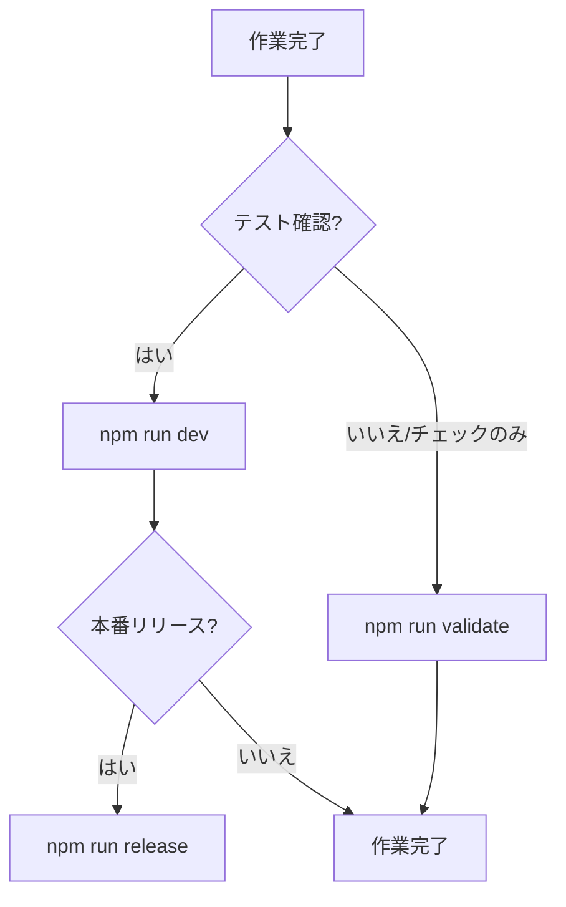

# AI_INSTRUCTIONS.md (AIへの指示書)

> このファイルは、このリポジトリでAIと開発作業を行う際の、ルールとガイドラインを定義する。

## 最重要ルール

このセクションは、このプロジェクトで作業する上での最も重要なルール。何をするにも、まずこれらのルールを最優先すること。

1. **編集対象は `src/` のみ:**
   - **絶対に `build-output/` ディレクトリ内のファイルは編集しないこと。** すべての開発作業は `src/` ディレクトリで行う。

2. **品質チェックと反映:**
   - コード変更後、テスト環境へ反映する場合 → `npm run dev` を実行すること
   - チェックのみ（pushしない）場合 → `npm run validate` を実行すること

3. **定義済みのワークフローに従う:**
   - 開発、テスト、本番反映の一連の作業は、後述の「コマンド選択ガイド」に記載された手順に従うこと。

4. **UIコンポーネントの再利用:**
   - フロントエンドのUI要素を追加・変更する際は、必ず `src/frontend/13_WebApp_Components.js` に定義された既存のコンポーネントと `src/frontend/11_WebApp_Config.js` のデザイン定義を再利用すること。ゼロからHTMLを作成しないこと。

5. **開発時の`import`文は依存関係の明示用途に限定:**
   - `src/` 内ではESMの`import`文を記述できるが、ビルド時に自動削除されるため、**同名のグローバル識別子を参照する目的にのみ使用すること**。
   - **禁止事項:** デフォルトインポート、別名（`import { foo as bar }`）、`import * as foo`、動的`import()`は使用しないこと。削除後にローカル識別子が残らず、実行時エラーを引き起こす。
   - すべての`import`はファイル先頭のトップレベルで記述し、末尾にセミコロンを付けること。

---

## コマンド選択ガイド

`npm run dev` は型生成・型チェックを含むため、事前の `types:refresh` は不要。



### 主要コマンド

| コマンド           | 用途                                                |
| ------------------ | --------------------------------------------------- |
| `npm run validate` | チェックのみ（format + lint + 型生成 + 型チェック） |
| `npm run dev`      | **★メイン** 修正 + ビルド + テスト環境push          |
| `npm run release`  | 修正 + ビルド + 本番push + デプロイ                 |

### 特殊用途

| コマンド              | 用途                                                   |
| --------------------- | ------------------------------------------------------ |
| `npm run watch`       | UI微調整時の自動ビルド（ユーザー用、AI開発では不使用） |
| `npm run build:force` | 品質チェックスキップ（緊急時のみ）                     |

### その他のコマンド

<details>
<summary>フォーマット・Lint（個別実行）</summary>

| コマンド              | 用途                               |
| --------------------- | ---------------------------------- |
| `npm run format`      | Prettierによるフォーマットチェック |
| `npm run format:fix`  | Prettierによるフォーマット自動修正 |
| `npm run lint`        | ESLintによるLintチェック           |
| `npm run lint:fix`    | ESLintによる自動修正               |
| `npm run lint:md`     | Markdownファイルのチェック         |
| `npm run lint:md:fix` | Markdownファイルの自動修正         |

</details>

<details>
<summary>型定義関連（個別実行）</summary>

| コマンド                 | 用途                                                 |
| ------------------------ | ---------------------------------------------------- |
| `npm run types:refresh`  | 型定義を再生成 → 型チェック（`validate` に含まれる） |
| `npm run types:generate` | 型定義ファイル（`.d.ts`）のみを再生成                |
| `npm run types:check`    | 型チェックのみを実行                                 |

</details>

<details>
<summary>URL取得（MCP DevTools用）</summary>

| コマンド                | 用途                           |
| ----------------------- | ------------------------------ |
| `npm run url:exec:test` | テスト環境の公開WebApp URL取得 |
| `npm run url:exec:prod` | 本番環境の公開WebApp URL取得   |

**注意**: スクリプトエディタのURLはGoogleログインが必要なため、MCP DevToolsでは開けない。

</details>

---

## AIへの指示

### 基本原則

- **最重要ルールの遵守**: ファイル冒頭の「最重要ルール」を常に最優先すること。
- **ワークフローの遵守**: 「コマンド選択ガイド」に記載された手順に従うこと。
- **既存コードの尊重**: 既存のコードスタイル、命名規則、アーキテクチャを尊重し、一貫性を保つこと。

### コード追加前チェックリスト（DRY原則）

新しいロジックを実装する前に、以下をgrep検索すること：

1. **同名・類似名の関数**: 実装しようとしている処理のキーワードで検索
2. **ユーティリティファイル**（優先的に確認）:
   - `14_WebApp_Handlers_Utils.js` - フロントエンド共通
   - `12_WebApp_Core_Search.js` - 検索・フィルタリング
   - `08_Utilities.js` - バックエンド共通
3. **パターンの抽象化**: 同じようなロジックを2回以上書く場合は、ヘルパー関数に抽出することを検討
4. **重複を発見した場合**: 既存コードに重複パターンを見つけた場合は、リファクタリングを提案すること

### コミュニケーションと言語

- **主要言語**: **恒久的に日本語を使用すること。** ユーザーへの応答、作成するドキュメント、コミットメッセージなど、すべての出力は日本語で行うこと。
- **コードコメント**: 新しいコメントを追加する際は、日本語で記述すること。

### Git/GitHubワークフロー

このプロジェクトでは、GitHubを使用してコード管理とコラボレーションを行う。以下のワークフローに従うこと。

#### ブランチ戦略

- **mainブランチ**: 本番環境にデプロイ済みの安定版コード
- **フィーチャーブランチ**: 新機能開発やバグ修正用の一時的なブランチ
  - 命名規則: `feature/機能名`, `fix/バグ内容`, `refactor/対象`
  - 例: `feature/new-ui`, `fix/cache-bug`, `refactor/accounting-module`

#### 開発フロー

1. **ブランチ作成**

   ```bash
   git checkout main
   git pull origin main
   git checkout -b feature/your-feature-name
   ```

2. **開発とコミット**
   - 適切な節目（機能完成、バグ修正、重要な変更点）でコミット
   - コミット前にユーザーに確認: 「コミットしますか？」
   - コミットメッセージは日本語で明確に記述

   ```bash
   git add -A
   git commit  # コミットメッセージはエディタで編集
   ```

3. **プルリクエスト作成**
   - 作業完了後、リモートにプッシュしてPRを作成
   - PRタイトルと説明は日本語で明確に

   ```bash
   git push origin feature/your-feature-name
   gh pr create --base main --title "PRタイトル" --body "詳細説明"
   ```

4. **レビューと修正**
   - AIレビューコメント（Gemini Code Assist, ChatGPT Codex）を確認
   - 必要に応じて修正を追加コミット

5. **マージ**
   - レビュー承認後、PRをマージ
   - マージ後はローカルのmainブランチを更新

   ```bash
   gh pr merge --squash  # または --merge
   git checkout main
   git pull origin main
   ```

#### コミットメッセージの形式

```text
fix: 売上ログを別シートに記録するよう修正

会計処理後に売上ログが別スプレッドシートへ書き込まれない問題を修正。
SpreadsheetManagerに外部シート用キャッシュを追加し、売上ログ書き込み処理で利用。

🤖 Generated with [Claude Code](https://claude.com/claude-code)
```

- 先頭の `<type>:` は任意だが、`fix` / `feat` / `refactor` などを付けると履歴管理がしやすくなる
- 変更内容に応じて説明の詳細度を調整すること
- コミットに関与したAIごとに署名行（`🤖 Generated with ...` など）を必ず含めること

### Markdown品質ガイドライン

- **見出しの使用**: セクションタイトルには、強調（**太字**）ではなく、適切なレベルの見出し（`##`など）を使用すること
- **見出しの重複**: 同じ内容の見出しを複数作成しないこと
- **コードブロックの言語指定**: コードブロックには常に言語（javascript, text, json, bash, htmlなど）を指定すること

### タスク管理とTODO

- **`docs/TODO.md`**: プロジェクトのタスク、バグ、アイデアを管理するファイル
- **Inbox（未整理メモ）**: ユーザーが思いついたことを自由に記述する場所。AIは定期的にこのセクションを確認し、適切なカテゴリーに整理・分類すること

---

## プロジェクト概要

このプロジェクトは、木彫り教室の予約管理システム「きぼりの よやく・きろく」。Google Apps Script（GAS）で構築されており、Googleスプレッドシートをデータベースとして使用し、Webアプリケーションのインターフェースを提供する。

開発者は、木彫り教室の唯一の講師であり、経営者であり、このシステムの管理者。

### 関連ドキュメント

| ドキュメント                                                  | 内容                                 |
| ------------------------------------------------------------- | ------------------------------------ |
| [DATA_MODEL.md](docs/DATA_MODEL.md)                           | データモデル設計（統合・正規化済み） |
| [JS_TO_HTML_ARCHITECTURE.md](docs/JS_TO_HTML_ARCHITECTURE.md) | JavaScript分離開発アーキテクチャ     |
| [TYPES_GUIDE.md](docs/TYPES_GUIDE.md)                         | 型定義使用ガイド・型定義生成システム |

---

## アーキテクチャ概要

### 開発環境: JSDoc + checkJs + 型定義自動生成

このプロジェクトは、GASの制約下でモダンな開発体験を実現するため、以下の3つの技術を組み合わせた開発環境を採用している。

1. **JSDocによる型付け:** ソースコード（`.js`）内にJSDoc形式で`@param`や`@type`などを記述し、型情報を定義
2. **`checkJs`によるリアルタイム検証:** `tsconfig.json`の`checkJs`設定により、TypeScriptコンパイラがJSDocとコードの間に矛盾がないかを常に監視
3. **型定義ファイルの自動生成システム:** JSDocからTypeScriptの型定義ファイル（`.d.ts`）を自動生成し、ファイル間でのコード補完や型参照を実現

> [!NOTE]
> 型定義生成の詳細な仕組みは [TYPES_GUIDE.md](docs/TYPES_GUIDE.md#型定義生成システム) を参照。

### 型エラーの対処法

型チェックでエラーが発生した場合、**安易にインデックスシグネチャ（`state['propertyName']`）を使った回避策を取らず**、根本的な型定義を修正すること。

**❌ 避けるべき対処法:**

```javascript
// ブラケット記法での回避（推奨しない）
const value = state['expandedLessonId'];
```

**✅ 推奨される対処法:**

1. **手動管理の型定義ファイルを修正する**（`types/core/`, `types/view/` など）

   ```typescript
   // types/view/state.d.ts
   export interface UIState {
     expandedLessonId?: string | null; // 不足していたプロパティを追加
   }
   ```

2. **ソースコードではドット記法を使用する**

   ```javascript
   // 型定義修正後はドット記法でアクセス可能
   const value = state.expandedLessonId;
   ```

### ビルドプロセスによるコード変換

開発のしやすさとGAS環境の互換性を両立させるため、ビルドプロセス実行時に以下のコード自動変換が行われる。

1. **`import` / `export` 文の除去:** GAS環境ではサポートされていないため、ビルド時に自動的に取り除かれる
2. **定数ファイルの注入:** `src/shared/00_Constants.js` は、フロントエンドとバックエンドの両方に自動的に組み込まれる
3. **環境変数の設定:** `CONSTANTS.ENVIRONMENT.PRODUCTION_MODE` の値が、ビルドターゲットに応じて自動的に設定される

### ファイル構成

開発はすべて `src/` ディレクトリ内で行う。ビルド後、この構造が `build-output/` に反映される。

| ディレクトリ     | 内容                                                         |
| ---------------- | ------------------------------------------------------------ |
| `src/backend/`   | サーバーサイドロジック（API、DB操作、GASコア機能）           |
| `src/frontend/`  | フロントエンドロジック（UIビュー、コンポーネント、ハンドラ） |
| `src/shared/`    | 共有コード（`00_Constants.js` のみ）                         |
| `src/templates/` | HTMLテンプレート（`10_WebApp.html`）                         |

### フロントエンドとバックエンドの境界

- **原則:** フロントエンドとバックエンドは物理的に異なる環境で動作するため、互いの関数や変数を直接参照することはできない
- **通信:** フロントエンドからバックエンドへの通信は、必ず `google.script.run` を介して非同期で行う
- **唯一の例外:** `src/shared/00_Constants.js` のみ、ビルドプロセスによって両環境でグローバルな `CONSTANTS` オブジェクトとして利用可能になる

### データモデルとキャッシュ

Googleスプレッドシートをベースにした統合データモデル。詳細は [DATA_MODEL.md](docs/DATA_MODEL.md) を参照。

**多層キャッシュ**:

- **CacheService**: GASの組み込みキャッシュ。予約、生徒名簿などを6-24時間保持。
  - **差分更新システム (v5.0)**: 予約変更時に全件リロードせず、差分のみを更新することで95%以上の高速化を実現
  - **分割キャッシュシステム (v5.5)**: 90KBを超えるデータを自動で分割し、100KBの制限を回避
- **SpreadsheetManager**: スプレッドシートオブジェクトのセッション内キャッシュ

### フロントエンドアーキテクチャ

**UIコンポーネントシステム (アトミックデザイン)**

- **場所**: `src/frontend/13_WebApp_Components.js`
- **設計原則**: 小さな部品（Atomic）から大きなUI（Organisms）を構築。再利用性を重視。
- **主要コンポーネント**: `Components.button`, `Components.modal`, `Components.cardContainer` など、定義済みのUI部品を常に使用すること。

**デザインシステム (DesignConfig)**

- **場所**: `src/frontend/11_WebApp_Config.js`
- **設計原則**: 色、余白、タイポグラフィなどのデザイン要素を定数として一元管理。ハードコードは禁止。
