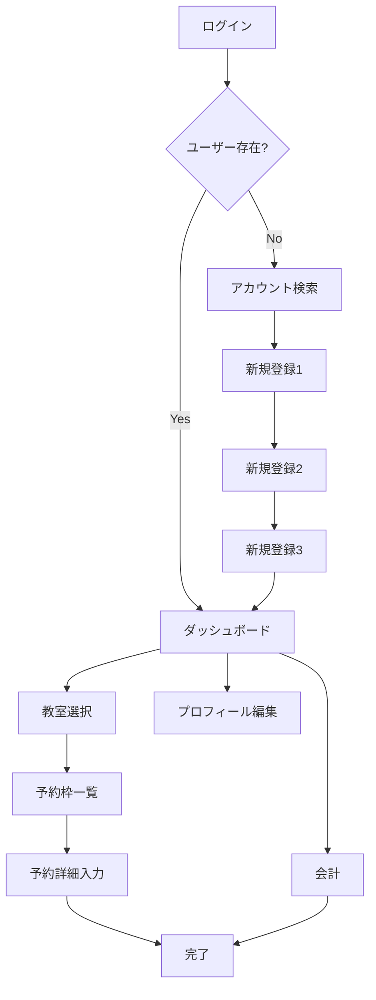

# フロントエンド構造分析とTASK5実装計画

**作成日**: 2025年8月27日  
**対象**: HTML生成ロジックのリファクタリングとコンポーネント化（TASK5）  
**目的**: 安全で効率的な実装のための事前調査と詳細計画

## 1. 現状分析

### 1.1 現在のファイル構成

```
src/
├── 10_WebApp.html              # メインHTMLテンプレート
├── 11_WebApp_Config.html       # フロントエンド設定とデザイン定数
├── 12_WebApp_Core.html         # コアユーティリティ + Components定義
├── 12_WebApp_StateManager.html # 状態管理システム
├── 13_WebApp_Views.html        # UI生成関数群（1,363行）
└── 14_WebApp_Handlers.html     # イベントハンドラーとビジネスロジック
```

### 1.2 インクルード順序（現在）

```html
<?!= include('11_WebApp_Config'); ?>
<?!= include('12_WebApp_StateManager'); ?>
<?!= include('12_WebApp_Core'); ?>
<?!= include('13_WebApp_Views'); ?>
<?!= include('14_WebApp_Handlers'); ?>
```

**計画されている変更後の順序**:
```html
<?!= include('11_WebApp_Config'); ?>
<?!= include('12_WebApp_StateManager'); ?>
<?!= include('12_WebApp_Core'); ?>
<?!= include('13_WebApp_Components'); ?>  # 新規作成
<?!= include('13_WebApp_Views'); ?>
<?!= include('14_WebApp_Handlers'); ?>
```

### 1.3 現在のComponents構造

**場所**: `12_WebApp_Core.html` (約600行目以降)

```javascript
const Components = {
  createButton: c => `<button>...</button>`,
  createInput: c => `<input>...</input>`,
  createSelect: c => `<select>...</select>`,
  createTextArea: c => `<textarea>...</textarea>`,
  // その他のコンポーネント
};
```

## 2. ページ遷移フロー分析

### 2.1 メインビュー一覧（14種類）

| ビュー名 | 関数名 | 主要機能 | 複雑度 |
|----------|--------|----------|--------|
| ログイン | `getLoginView()` | 電話番号入力 | 低 |
| アカウント検索 | `getUserSearchView()` | 名前検索・選択 | 中 |
| 新規登録1 | `getRegisterView()` | 基本情報入力 | 中 |
| 新規登録2 | `getRegistrationStep2View()` | プロフィール詳細 | 中 |
| 新規登録3 | `getRegistrationStep3View()` | 木彫り関連情報 | 中 |
| ダッシュボード | `getDashboardView()` | 予約一覧・履歴表示 | **高** |
| プロフィール編集 | `getEditProfileView()` | ユーザー情報更新 | 中 |
| 教室選択 | `getClassroomSelectionView()` | 教室一覧表示 | 低 |
| 予約枠一覧 | `getBookingView()` | 空き枠表示 | **高** |
| 予約詳細入力 | `getReservationFormView()` | 予約内容入力・編集 | **高** |
| 会計 | `getAccountingView()` | 料金計算・支払い | **超高** |
| 完了 | `getCompleteView()` | 処理完了表示 | 中 |

### 2.2 ページ遷移マップ



### 2.3 データフロー分析

**StateManager → Computed → Views**

```javascript
// データの流れ
stateManager.getState() 
  → computed.sortedBookings (自動計算)
  → getDashboardView() (ビュー生成)
  → createReservationCard() (コンポーネント呼び出し)
```

## 3. リファクタリング対象の特定

### 3.1 複雑度による優先度分類

#### 🔴 超高複雑度（最優先）
- **`getAccountingView()`** (89行, 複雑な条件分岐)
  - 時間制/固定制の授業料計算UI
  - 材料代の動的行生成
  - 会計済み表示と新規会計フォーム
  
#### 🟠 高複雑度  
- **`getDashboardView()`** (143行)
  - 予約カード生成ロジック
  - 履歴表示とページネーション
  
- **`getReservationFormView()`** (242行)  
  - 新規作成と編集の条件分岐
  - 教室別の時間選択UI
  - オプション設定

- **`getBookingView()`** + **`renderBookingSlots()`** (合計97行)
  - 月別グループ化
  - 予約状況別のスタイリング

#### 🟡 中複雑度
- 新規登録系ビュー（Step1-3）
- ユーザー検索・プロフィール編集

#### 🟢 低複雑度
- ログイン、教室選択、完了画面

### 3.2 現在のコンポーネント使用状況

#### 既存コンポーネントの使用頻度
```javascript
// 使用頻度順
Components.createButton()     // 38回使用
Components.createInput()      // 12回使用  
Components.createTextArea()   // 8回使用
Components.createSelect()     // 6回使用
```

#### コンポーネント化されていない複雑なHTML生成
1. **会計フォームのテーブル** (`buildMaterialRow`, `getOtherSalesRowHtml`)
2. **予約カード** (`createReservationCard`) - 既に部分的にコンポーネント化済み
3. **時間制授業料計算UI** (`getTimeBasedTuitionHtml`)
4. **支払い方法選択** (`getPaymentOptionsHtml`)

## 4. 実装計画

### Phase A: 現状詳細調査（2-3時間）

#### A1. データ依存関係マッピング
- [ ] StateManager `computed` プロパティの使用状況調査
- [ ] 各ビューで使用される `stateManager.getState()` プロパティの一覧化
- [ ] ビュー間でのデータ受け渡し方法の確認

#### A2. 既存Componentの詳細分析  
- [ ] `12_WebApp_Core.html`内の全コンポーネント関数の仕様確認
- [ ] 各コンポーネントの引数仕様とデフォルト値の文書化
- [ ] 使用されていないコンポーネントの特定

#### A3. イベントハンドラー連携調査
- [ ] `14_WebApp_Handlers.html`との連携ポイント特定
- [ ] `data-action`属性の使用パターン調査

### Phase B: 新コンポーネント設計（2時間）

#### B1. コンポーネント分割戦略
```javascript
// 新規作成するコンポーネント例
const NewComponents = {
  // 会計関連
  createMaterialRow: (index, data) => "...",
  createAccountingTable: (items) => "...",
  createTimeBasedTuitionUI: (rule, initial) => "...",
  
  // 予約関連  
  createReservationCard: (config) => "...", // 既存から移動
  createBookingSlot: (slot, isBooked) => "...",
  createTimeSelector: (options) => "...",
  
  // フォーム関連
  createRegistrationStep: (stepConfig) => "...",
  createPaymentOptions: (selectedValue) => "...",
};
```

#### B2. ファイル構成設計
```
13_WebApp_Components.html の構造:
├── Base Components (既存から移動)
├── Form Components (新規)
├── Card Components (新規)  
├── Accounting Components (新規)
└── Booking Components (新規)
```

#### B3. 互換性確保計画
- 既存のコンポーネント名は変更しない
- 段階的移行で古いコンポーネントも併存

### Phase C: 段階的実装（8-12時間）

#### C1. Step 1: ファイル分離とセットアップ (2時間)
- [ ] `13_WebApp_Components.html` 新規作成
- [ ] `12_WebApp_Core.html`から`Components`オブジェクトを移動
- [ ] `10_WebApp.html`のインクルード順序変更
- [ ] 動作確認とテスト

#### C2. Step 2: 会計フォームのコンポーネント化 (4時間)  
**対象**: `getAccountingView()`, `buildMaterialRow()`, `getTimeBasedTuitionHtml()`
- [ ] 材料入力行コンポーネント化
- [ ] 時間制授業料UIコンポーネント化  
- [ ] 会計フォーム全体のリファクタリング
- [ ] 動作確認

#### C3. Step 3: ダッシュボードのコンポーネント化 (3時間)
**対象**: `getDashboardView()`, `createReservationCard()`  
- [ ] 予約カードコンポーネントの改善
- [ ] ダッシュボードのレイアウトコンポーネント化
- [ ] 履歴表示部分の整理

#### C4. Step 4: 予約フォーム関連 (3時間)
**対象**: `getReservationFormView()`, `renderBookingSlots()`
- [ ] 予約フォームセクションの分割
- [ ] 時間選択UIコンポーネント化
- [ ] 予約枠表示の改善

#### C5. Step 5: その他ビューの整理 (1-2時間)
- [ ] 新規登録フローの改善
- [ ] プロフィール編集フォーム
- [ ] 最終動作確認

### Phase D: テストと品質保証（2時間）

#### D1. 機能テスト
- [ ] 全ページの表示確認
- [ ] フォーム送信・イベント処理
- [ ] データ更新フローの確認

#### D2. パフォーマンステスト  
- [ ] ページ読み込み速度
- [ ] StateManager連携確認
- [ ] メモリリーク確認

#### D3. コード品質確認
- [ ] ESLint実行 (`npm run lint`)
- [ ] Prettier実行 (`npm run format`) 
- [ ] 統一テストファイル確認

## 5. リスク分析と対策

### 5.1 主要リスク

#### 🔴 高リスク
1. **StateManager依存の破損**
   - 既存の `computed` プロパティ計算ロジックの破損
   - **対策**: 段階的移行、各ステップでの動作確認

2. **イベントハンドラー連携の破損**  
   - `data-action`属性の不整合
   - **対策**: イベント属性の変更を最小限に抑制

#### 🟠 中リスク  
3. **コンポーネント引数仕様の不整合**
   - 既存コード呼び出し時の引数ミス
   - **対策**: TypeScript風JSDocの活用、入念なテスト

4. **CSS/スタイリングの破損**
   - DesignConfigクラスの適用ミス
   - **対策**: スタイル適用の一貫性確認

### 5.2 安全策

1. **段階的コミット**: 各Phase完了時に個別コミット
2. **バックアップブランチ**: 現在の`fix-weapp-reservation-editing`をバックアップ
3. **テスト環境確認**: `npm run push:test` で各段階をテスト
4. **フォールバック計画**: 問題時の即座のロールバック手順

## 6. 成功指標

### 6.1 定量的指標
- [ ] `13_WebApp_Views.html`の行数を20%以上削減（目標: 1,363行 → 1,100行以下）
- [ ] 新規コンポーネント数: 15-20個作成
- [ ] 全機能テストの100%通過

### 6.2 定性的指標
- [ ] コードの可読性向上（ビュー関数の宣言的記述化）
- [ ] 保守性向上（コンポーネントの再利用性）  
- [ ] 開発者体験向上（新機能追加の容易さ）

## 7. 次のステップ

1. **このドキュメントのレビュー**: ユーザーによる計画承認
2. **Phase A実施**: 詳細な現状調査の開始
3. **調査結果に基づく計画調整**: 必要に応じた工数・優先度の見直し

---

**注意**: この計画は現時点での分析に基づいています。Phase A の詳細調査結果により、実装方法や工数見積もりの調整が必要になる可能性があります。