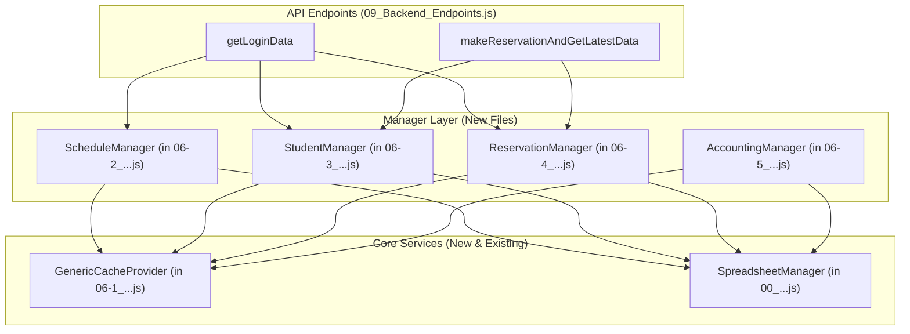

# バックエンド再編成計画書

## 1. 概要

この計画書は、バックエンドの構造的な健全性を向上させるためのリファクタリング計画を定義する。

主な目的は、現在複数の責務を抱え肥大化している`07_CacheManager.js`を、ドメイン（関心事）ごとに分割することである。この再編成を通じて、コードの可読性、保守性、拡張性を高め、同時に当初の課題であった「`reservation.user`の活用と重複したユーザー情報取得処理の排除」を、より体系的に達成することを目指す。

## 2. 現状の問題点

1. **CacheManagerの責務過多**: `07_CacheManager.js`が、予約、生徒、日程、会計という4つの異なるドメインのキャッシュ管理ロジックを一手に引き受けており、単一責任の原則に違反している。
2. **関心の分散**: 特定のドメインに関するロジックが複数のファイルに分散している。
   - 例: 「日程」に関するロジックは`07_CacheManager.js`（キャッシュ生成）と`02-4_BusinessLogic_ScheduleMaster.js`（キャッシュ利用）、`05-3_Backend_AvailableSlots.js`（空き枠計算）に散らばっている。
3. **保守性の低下**: ファイルが肥大化し、関連コードが分散しているため、仕様変更時の影響範囲の特定が困難であり、修正コストが高い。
4. **重複した情報取得**: 上記の構造的問題が、結果として`reservation.user`を十分に活用できず、個別にユーザー情報を取得する非効率なコードが温存される原因となっている。

## 3. 再編成計画

`07_CacheManager.js`を解体し、ドメイン駆動の設計に基づいた「マネージャー層」のファイル群を、既存の通し番号管理に沿って導入する。

### Phase 1: 基盤の構築 - `GenericCacheProvider`の作成

1. **目的**: ドメインに依存しない、汎用的なキャッシュ操作（チャンク分割、シリアライズ、`CacheService`への保存・取得）をカプセル化する。
2. **タスク**:
   - `06-1_Core_GenericCacheProvider.js` というファイル名で新規作成する。
   - `07_CacheManager.js`から、`splitDataIntoChunks`, `saveChunkedDataToCache`, `loadChunkedDataFromCache`, `clearChunkedCache`などの低レベルなキャッシュ操作関数を移植する。

### Phase 2: ドメインマネージャーの創設

1. **目的**: 各ドメインに関する責務（データ取得、キャッシュ管理、ビジネスロジック）を集約したファイル群を作成する。
2. **タスク**:
   - **`06-2_Manager_Schedule.js`の作成**:
     - `07_CacheManager.js`から`rebuildScheduleMasterCache`を移植する。
     - `02-4_BusinessLogic_ScheduleMaster.js`から`getAllScheduledDates`を移植する。
     - `05-3_Backend_AvailableSlots.js`から`getLessons`および空き枠計算ロジックを移植する。
     - キャッシュ操作は`06-1_Core_GenericCacheProvider.js`内の関数を呼び出すように修正する。
   - **`06-3_Manager_Student.js`の作成**:
     - `07_CacheManager.js`から`rebuildAllStudentsBasicCache`, `getCachedStudentById`, `getStudentWithEmail`を移植する。
   - **`06-4_Manager_Reservation.js`の作成**:
     - `07_CacheManager.js`から`rebuildAllReservationsCache`および全ての差分更新関数（`addReservationToCache`など）を移植する。
     - `05-3_Backend_AvailableSlots.js`から`getUserReservations`を移植する。
   - **`06-5_Manager_Accounting.js`の作成**:
     - `07_CacheManager.js`から`rebuildAccountingMasterCache`を移植する。

### Phase 3: 既存コードの呼び出し元修正

1. **目的**: 各ファイルが、古い`07_CacheManager.js`内の関数ではなく、新しく作成した各マネージャーファイル内の関数を呼び出すように修正する。
2. **タスク**:
   - `09_Backend_Endpoints.js`内の`getLoginData`が、`06-2_Manager_Schedule.js`内の`getLessons()`や`06-4_Manager_Reservation.js`内の`getUserReservations()`を呼び出すように変更する。
   - `05-2_Backend_Write.js`内の`makeReservation`などが、新しいマネージャーファイル群の関数を利用するように変更する。
   - その他、`getCachedData`を直接呼び出している箇所を、適切なマネージャーファイル内の関数呼び出しに置き換える。

### Phase 4: `reservation.user`活用のリファクタリング

1. **目的**: 整理された新しい構造の上で、当初の目的であった`reservation.user`の活用を徹底する。
2. **タスク**:
   - `06-4_Manager_Reservation.js`が予約データを取得する際に、`06-3_Manager_Student.js`内の関数と連携して`user`プロパティを付与する責務を持つように設計する。（`transformReservationArrayToObjectWithHeaders`のロジックをこの連携の中に集約する）
   - `02-5`, `02-6`, `02-7`の通知関連ファイル内で、`StudentManager`の関数から直接ユーザー情報を取得する代わりに、引数で渡された`reservation.user`を全面的に利用するように修正する。

### Phase 5: クリーンアップ

1. **目的**: 不要になった古いファイルと関数を安全に削除する。
2. **タスク**:
   - プロジェクト全体で参照がなくなったことを確認した上で、`07_CacheManager.js`を削除する。
   - 同様に、`02-4_BusinessLogic_ScheduleMaster.js`と`05-3_Backend_AvailableSlots.js`を削除する。
   - `06-3_Manager_Student.js`内の`getStudentWithEmail`など、不要になった関数を削除する。

## 4. 期待される効果

- **責務の明確化**: 各ファイルが単一の責任を持つようになり、コードの見通しが大幅に改善される。
- **保守性の向上**: 仕様変更時に修正すべきファイルが明確になり、デバッグや機能追加が容易になる。
- **テスト容易性の向上**: ドメインごとに独立したテストが可能になる。
- **パフォーマンス改善**: `reservation.user`の活用が徹底されることで、無駄なデータ取得処理がなくなり、処理速度が向上する。
