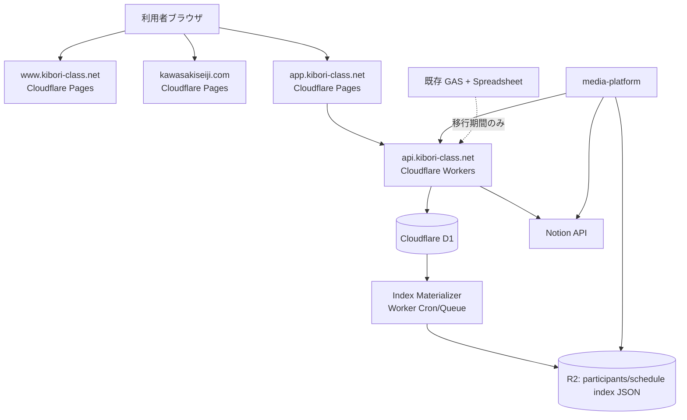

# Cloudflare + D1 統合移行計画（教室サイト・作家サイト・予約Webアプリ）

**作成日**: 2026年2月27日  
**更新日**: 2026年3月3日  
**ステータス**: Draft v2  
**位置づけ**: 実装着手前の検討資料（意思決定ドラフト）  
**対象**:

- 教室サイト（`https://www.kibori-class.net/`）
- 作家サイト（`kawasakiseiji.com`）
- 生徒作品ギャラリー/画像運用（`media-platform`）
- 予約・名簿・参加記録（現行: Spreadsheet + GAS）

**関連資料**:

- `docs/CLOUDFLARE_D1_MEDIA_PLATFORM_INTEGRATION_NOTES.md`（`media-platform` 連携の詳細検討）
- `docs/CLOUDFLARE_D1_YOYAKU_KIROKU_MIGRATION_NOTES.md`（`yoyaku-kiroku` 側の詳細検討）

## 1. 目的

- Google Sites + GAS に依存した現行構成を、Cloudflare 中心に段階移行する。
- 初期表示遅延（特に Spreadsheet/GAS 由来の待ち時間）を構造的に解消する。
- 教室サイトと作家サイトを同一運用方針で管理し、保守コストを下げる。
- 予約・名簿・参加記録の正本 DB を D1 に統一し、一元化する。
- `media-platform` の既存契約（`/participants-index` 等）を壊さず移行する。

## 2. 現状整理（2026-03-03 時点）

- 教室サイトは Google Sites で運用。
- 作家サイトは新規ドメインでこれから構築予定。
- `media-platform` で以下を実施中:
  - 生徒作品 gallery 生成
  - 自動 SNS 投稿
  - 画像アップロード UI
  - Notion へのメタデータ連携
- `media-platform` 管理UIは起動時に `/participants-index` / `/students-index` / `/tags-index` を取得する実装。
- SNS/月次運用では `schedule_index.json` を参照する運用がある。
- 予約・名簿・参加記録は Spreadsheet + GAS で管理し、予約 WebApp を教室サイトに埋め込み運用。

## 3. 方針（結論）

- フロント（閲覧系）は **Cloudflare Pages** へ集約。
- API は **Cloudflare Workers** へ移行。
- DB は **Cloudflare D1** を採用し、予約系データの正本を D1 に固定する。
- 画像は既存どおり **R2 + media-platform** を活用。
- 読み取り方式は用途で分離する（ハイブリッド運用）。

| ユースケース                               | 読み取り方式          | 目的                   |
| ------------------------------------------ | --------------------- | ---------------------- |
| 予約Webアプリ（空き枠/予約一覧/詳細）      | Worker -> D1 直接読み | 整合性・最新性を優先   |
| `media-platform` 管理UIの初期ロード        | index JSON（R2）      | 低遅延・既存互換を優先 |
| SNS/月次運用（`schedule_index.json` 利用） | index JSON（R2）      | 既存ジョブ互換を維持   |

- Spreadsheet/GAS は移行期間のみ補助系として扱い、最終的に参照専用化して縮退する。
- ブラウザから D1 へ直接アクセスはしない（必ず Worker API 経由）。
- 移行初期の D1 生成対象は `participants/schedule` を優先し、`students/tags` は既存経路を維持しながら段階見直しする。
- 本書では `/xxx-index`（配信エンドポイント）と `xxx_index.json`（R2オブジェクト）を同一契約面として扱う。

## 4. ターゲット構成

### 4.1 ドメイン設計案

| ドメイン                          | 役割                        | 基盤         |
| --------------------------------- | --------------------------- | ------------ |
| `www.kibori-class.net`            | 教室サイト（公開情報）      | Pages        |
| `app.kibori-class.net`            | 予約Webアプリ（会員向けUI） | Pages        |
| `api.kibori-class.net`            | 予約・名簿・参加記録 API    | Workers + D1 |
| `kawasakiseiji.com`               | 作家サイト（公開情報）      | Pages        |
| `assets.kibori-class.net`（任意） | 画像配信（必要時）          | R2 + CDN     |

### 4.2 システム構成図

## 5. D1 データ設計（初版）

### 5.1 管理対象

- 生徒名簿
- 予約データ
- 参加記録
- レッスン日程（空き枠計算の基礎）
- 操作履歴（監査ログ）

### 5.2 主要テーブル案

| テーブル             | 用途                        |
| -------------------- | --------------------------- |
| `students`           | 生徒基本情報                |
| `guardians`          | 保護者/連絡先（必要な場合） |
| `lessons`            | レッスン日程マスタ          |
| `reservations`       | 予約本体                    |
| `attendance_records` | 参加記録                    |
| `reservation_events` | 予約変更履歴（監査）        |
| `sync_jobs`          | 移行期間の同期ジョブ管理    |

### 5.3 最低限の設計ルール

- 主キーは UUID（文字列）で統一。
- `created_at` / `updated_at` を全テーブルで管理。
- 予約状態は enum 相当（`pending` / `confirmed` / `cancelled` など）を明示。
- 空き枠計算に必要なインデックスを最初から付与。
- 監査が必要な更新は `reservation_events` に追記。
- 書き込み起点は Worker API に一本化し、DB 直接更新を禁止する。

### 5.4 読み取りモデル方針

- 予約確定可否に関わる画面は D1 直読み API を使う。
- 一覧・候補表示など大量参照系は index JSON を使う。
- `participants/schedule` の index は D1 から再生成する二次データ（正本ではない）として扱う。
- `students/tags` は移行初期は既存配信経路を維持し、正本境界確定後に切替可否を判断する。

## 6. `media-platform` 連携の扱い（本書と別紙の分離）

- 本書は「統合移行の意思決定」を目的とした資料とし、全体方針・フェーズ・主要リスクのみを扱う。
- `media-platform` 側の詳細仕様（既存エンドポイント互換、JSONスキーマ、鮮度SLO、切替手順）は別紙で管理する。
- 別紙: `docs/CLOUDFLARE_D1_MEDIA_PLATFORM_INTEGRATION_NOTES.md`

本書で決める項目:

- 正本境界（D1 / Notion / R2）
- 読み取り方式の原則（D1直読とJSON配信の使い分け）
- フェーズごとの退出条件と最終切替判定

別紙で検討する項目:

- `/participants-index` など既存契約の互換条件
- index JSON 再生成方式（イベント駆動/定期）と鮮度監視
- `media-platform` 側の影響評価、検証観点、移行手順

## 7. 段階移行計画

### Phase 0: 設計確定（1〜2週間）

- 要件凍結（画面、API、データ項目、運用フロー）。
- D1 スキーマ確定。
- API 契約（エンドポイント/レスポンス）確定。
- `media-platform` 連携契約を確定（index JSON と Notion連携の責務境界）。
- 書き込み権限マトリクスを確定（D1を正本、Spreadsheetは参照専用へ移行）。

**完了条件**

- ER 図と API 仕様が合意済み。
- 既存 Spreadsheet 項目とのマッピング表が完成。
- `participants/schedule/students/tags/gallery` の更新責務が文書化済み。
- 認証/認可方針（管理API、会員向けAPI、運用者権限）が文書化済み。

### Phase 1: 静的サイト移行（1〜2週間）

- 教室サイトを Pages へ移設（公開ページのみ）。
- 作家サイトを Pages で新規構築。
- 既存 SEO 重要ページの URL 設計を固定（リダイレクト方針含む）。

**完了条件**

- `www.kibori-class.net` と `kawasakiseiji.com` が Pages で公開済み。
- 旧サイトからの主要導線が維持されている。

### Phase 2: 予約 API + 読み取りモデル構築（2〜4週間）

- Workers + D1 で予約 API を新設。
- 読み取り系（空き枠、予約一覧、プロフィール参照）を D1 直読で実装。
- D1 を元に `participants_index.json` / `schedule_index.json` を自動生成する経路を追加。
- `app.kibori-class.net` のフロント骨格を構築。

**完了条件**

- ログイン前後の主要表示が GAS なしで成立。
- 主要読み取り API の p95 が目標値内（stg 計測で合意済み閾値）。
- `media-platform` 側の管理UIが既存エンドポイントで動作する。
- index JSON の鮮度SLO監視が稼働している。

### Phase 3: 書き込み系の並行運用（2〜4週間）

- 予約作成/変更/キャンセルを Worker API 経由に統一する。
- D1 を唯一の書き込み正本とし、Spreadsheet は参照専用へ移行する。
- 移行期間の同期は D1 -> Spreadsheet の片方向に限定する。
- 監査ログと再実行可能な同期ジョブを導入する。
- GAS由来の index POST はフェイルセーフ用途に限定し、主経路を D1 側に切替える。

**完了条件**

- 主要操作を D1 経由で実運用可能。
- Spreadsheet への手動更新停止が運用で徹底されている。
- 不整合検知と復旧手順が文書化済み。
- index JSON の生成・配信が D1 起点で安定運用できる。

### Phase 4: GAS 縮退・切替完了（1〜2週間）

- 教室サイト埋め込みを `app.kibori-class.net` へ置換。
- GAS WebApp 導線を停止。
- Spreadsheet 依存を参照専用または停止に変更。
- GAS の `pushParticipantsIndexToWorker` / `pushScheduleIndexToWorker` を停止。

**完了条件**

- 日常運用が Cloudflare + D1 側で完結。
- 障害時のロールバック手順が検証済み（復旧演習ログあり）。

### Phase 5: 最適化（任意）

- 指標を見ながら、鮮度要件の高い画面のみ D1 直読を追加検討する。
- `media-platform` 側は JSON 互換契約を維持し、破壊的変更は v2 並行提供で進める。

## 8. 運用設計（セキュリティ含む）

- 環境分離: `dev` / `stg` / `prod` を分ける。
- D1 も環境ごとに DB を分離。
- Secrets（API キー、Notion Token など）は Workers Secrets で管理。
- 管理UI/APIは認証済みユーザーのみアクセス可能にする（Cloudflare Access + APIトークン/JWT）。
- 監視:
  - API エラー率
  - 主要 API の p95 レイテンシ
  - index JSON 鮮度（`generated_at` 遅延）
  - 同期ジョブ失敗率
- 復旧:
  - D1 バックアップ/エクスポートの定期実行
  - 復元手順の定期演習（RTO/RPO確認）

## 9. 費用方針（D1 採用前提）

- 方針は「無料枠を活用しつつ、必要時に Workers Paid（最低 $5/月クラス）を許容」。
- 固定費を抑えつつ、アクセス増加に応じて従量課金を受け入れる。
- 詳細な見積りは、以下を確定後に再計算する:
  - 月間ページビュー
  - API リクエスト数
  - D1 クエリ件数（直読系）
  - R2 転送量・保存量（index JSON 含む）

## 10. 主なリスクと対応

| リスク               | 内容                                       | 対応                                                         |
| -------------------- | ------------------------------------------ | ------------------------------------------------------------ |
| データ不整合         | 並行運用中に D1 と Spreadsheet がズレる    | D1正本固定 + 片方向同期 + 差分検証バッチ                     |
| 仕様漏れ             | GAS 側の暗黙仕様が移行時に欠落             | 既存フローをユースケース単位で棚卸し                         |
| 移行長期化           | 既存運用を止められず二重管理化             | Phase ごとの退出条件を厳格化                                 |
| コスト見積り誤差     | 想定外トラフィックで課金増                 | API/D1/R2 利用量を月次レビュー                               |
| 連携責務の衝突       | D1とNotionで同一項目を重複更新して競合     | 正本テーブルを定義し、重複更新を禁止                         |
| JSON互換崩れ         | 既存管理UIが想定外スキーマで壊れる         | キー互換維持 + v2並行提供 + 段階切替                         |
| index鮮度劣化        | 再生成遅延で候補表示が古くなる             | 鮮度SLO監視 + 自動再実行 + 5分超過時アラート                 |
| セキュリティ設計不足 | 管理APIや個人情報アクセス制御が曖昧        | 認証/認可方針の先行確定 + 最小権限 + 監査ログ                |
| 復旧不能リスク       | 障害時に復元手順が機能せず停止時間が長引く | バックアップ定期実行 + 復元演習 + ロールバック手順の事前検証 |

## 11. 直近アクション（次に着手する項目）

1. Spreadsheet の現行カラム定義を確定し、D1 マッピング表を作る。
2. 予約 API の最小仕様を確定する（直読APIと管理APIの境界を明示）。
3. `participants_index.json` / `schedule_index.json` の D1生成版スキーマを確定し、既存互換テストを用意する。
4. index Materializer（更新時トリガー + 定期ジョブ）の最小実装を作る。
5. `media-platform` 管理UIで `/participants-index` / `/students-index` / `/tags-index` の実接続確認（既存経路含む）を行う。
6. 認証/認可・監査・復旧（RTO/RPO）を含む運用Runbookを作成する。

---

この計画は「段階移行」を前提とし、まず公開サイトを安定移設し、その後に予約基盤を D1 へ移す構成です。  
最終ゴールは、日常運用を Cloudflare（Pages/Workers/D1/R2）で完結させることです。  
その上で、`media-platform` との互換性を守るため、移行初期は index JSON 契約を維持し、必要な箇所のみ D1 直読へ段階的に寄せます。
