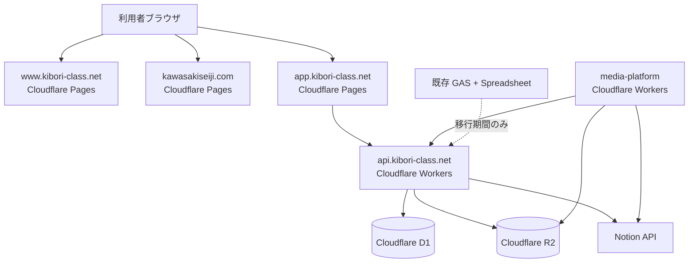

# Cloudflare + D1 統合移行計画（教室サイト・作家サイト・予約Webアプリ）

**作成日**: 2026年2月27日  
**ステータス**: Draft v1  
**対象**:

- 教室サイト（`https://www.kibori-class.net/`）
- 作家サイト（`kawasakiseiji.com`）
- 生徒作品ギャラリー/画像運用（`media-platform`）
- 予約・名簿・参加記録（現行: Spreadsheet + GAS）

## 1. 目的

- Google Sites + GAS に依存した現行構成を、Cloudflare 中心に段階移行する。
- 初期表示遅延（特に GAS WebApp の TTFB 依存）を構造的に解消する。
- 教室サイトと作家サイトを同一運用方針で管理し、保守コストを下げる。
- DB を D1 に統一し、予約・名簿・参加記録を一元化する。

## 2. 現状整理（2026-02-27 時点）

- 教室サイトは Google Sites で運用。
- 作家サイトは新規ドメインでこれから構築予定。
- `media-platform` で以下を実施中:
  - 生徒作品 gallery 生成
  - 自動 SNS 投稿
  - 画像アップロード UI
  - Notion へのメタデータ連携
- 予約・名簿・参加記録は Spreadsheet + GAS で管理し、予約 WebApp を教室サイトに埋め込み運用。

## 3. 方針（結論）

- フロント（閲覧系）は **Cloudflare Pages** へ集約。
- API は **Cloudflare Workers** へ移行。
- DB は **Cloudflare D1** を採用。
- 画像は既存どおり **R2 + media-platform** を活用。
- 既存 Spreadsheet/GAS は「移行期間の並行運用先」として扱い、段階的に縮退。

## 4. ターゲット構成

### 4.1 ドメイン設計案

| ドメイン                          | 役割                        | 基盤         |
| --------------------------------- | --------------------------- | ------------ |
| `www.kibori-class.net`            | 教室サイト（公開情報）      | Pages        |
| `app.kibori-class.net`            | 予約Webアプリ（会員向けUI） | Pages        |
| `api.kibori-class.net`            | 予約・名簿・参加記録 API    | Workers + D1 |
| `kawasakiseiji.com`               | 作家サイト（公開情報）      | Pages        |
| `assets.kibori-class.net`（任意） | 画像配信（必要時）          | R2 + CDN     |

### 4.2 システム構成図

## 5. D1 データ設計（初版）

### 5.1 管理対象

- 生徒名簿
- 予約データ
- 参加記録
- レッスン日程（空き枠計算の基礎）
- 操作履歴（監査ログ）

### 5.2 主要テーブル案

| テーブル             | 用途                                     |
| -------------------- | ---------------------------------------- |
| `students`           | 生徒基本情報                             |
| `guardians`          | 保護者/連絡先（必要な場合）              |
| `lessons`            | レッスン日程マスタ                       |
| `reservations`       | 予約本体                                 |
| `attendance_records` | 参加記録                                 |
| `reservation_events` | 予約変更履歴（監査）                     |
| `sync_jobs`          | GAS/Spreadsheet との同期管理（移行期間） |

### 5.3 最低限の設計ルール

- 主キーは UUID（文字列）で統一。
- `created_at` / `updated_at` を全テーブルで管理。
- 予約状態は enum 相当（`pending` / `confirmed` / `cancelled` など）を明示。
- 空き枠計算に必要なインデックスを最初から付与。
- 監査が必要な更新は `reservation_events` に追記。

## 6. `media-platform` / Notion 連携設計（実装確認反映）

### 6.1 現行実装の連携ポイント（2026-02-27 確認）

- `media-platform` は以下のJSON/API前提で動作している。
  - `gallery.json`（Notion -> `auto-post export-gallery-json` -> R2）
  - `participants_index.json`（現行は GAS が生成して Worker `/participants-index` へ POST）
  - `schedule_index.json`（現行は GAS が生成して Worker `/schedule-index` へ POST）
  - `students_index.json` / `tags_index.json`（Notionベースで生成してR2配置）
- 管理UI (`apps/admin-web`) は起動時に `/participants-index` / `/students-index` / `/tags-index` を fetch している。
- `students_index.json` は Notion 生徒DBがない場合に `participants_index.json` をフォールバック入力として利用する実装がある。

### 6.2 責務分担（D1移行後）

- 正本（Single Source of Truth）を以下に固定する。
  - 予約・日程・生徒参加情報: **D1**
  - 作品メタデータ・タグ・投稿状態: **Notion**
  - 画像実体: **R2**
- `media-platform` は以下の2系統でデータを扱う。
  - 作品系: 従来どおり Notion 起点（`gallery.json` 生成含む）
  - 教室運用補助系（当日参加者候補/日程候補）: D1 起点で生成した index JSON を参照

### 6.3 JSON運用方針（手動エクスポートの廃止）

- `participants_index.json` / `schedule_index.json` は残す（UI互換のため）。
- ただし生成元は GAS から D1 Worker に置換する。
- 運用は「手動出力」ではなく、以下へ移行する。
  - D1更新イベントまたは定期ジョブで自動再生成
  - 生成JSONをR2へ配置（現行キー互換: `participants_index.json` / `schedule_index.json`）
- 結果として、Spreadsheet -> JSON の手作業更新は不要化する。

### 6.4 互換性維持ルール

- 既存UI互換のため、移行初期は以下を維持する。
  - エンドポイント名: `/participants-index`, `/schedule-index`, `/students-index`, `/tags-index`
  - JSONキー: `generated_at`, `timezone`, `dates` など既存キーを保持
  - キャッシュ方針: index JSON は短TTL（現行同等）
- 破壊的変更（キー名変更・構造変更）は v2 スキーマを別キーで並行提供してから切替える。

## 7. 段階移行計画

### Phase 0: 設計確定（1〜2週間）

- 要件凍結（画面、API、データ項目、運用フロー）。
- D1 スキーマ確定。
- API 契約（エンドポイント/レスポンス）確定。
- `media-platform` 連携契約を確定（index JSON と Notion連携の責務境界）。

**完了条件**

- ER 図と API 仕様が合意済み。
- 既存 Spreadsheet 項目とのマッピング表が完成。
- `participants/schedule/students/tags/gallery` の更新責務が文書化済み。

### Phase 1: 静的サイト移行（1〜2週間）

- 教室サイトを Pages へ移設（公開ページのみ）。
- 作家サイトを Pages で新規構築。
- 既存 SEO 重要ページの URL 設計を固定。

**完了条件**

- `www.kibori-class.net` と `kawasakiseiji.com` が Pages で公開済み。
- 旧サイトからの主要導線が維持されている。

### Phase 2: 予約 API 基盤構築（2〜4週間）

- Workers + D1 で予約 API を新設。
- まずは読み取り系（空き枠、予約一覧、プロフィール参照）を実装。
- `app.kibori-class.net` のフロント骨格を構築。
- D1 を元に `participants_index.json` / `schedule_index.json` を自動生成する経路を追加。

**完了条件**

- ログイン前後の主要表示が GAS なしで成立。
- 初期表示 KPI を満たす（目標: 体感 1秒台前半〜2秒台）。
- `media-platform` 側の管理UIが既存エンドポイントで動作する。

### Phase 3: 書き込み系の並行運用（2〜4週間）

- 予約作成/変更/キャンセルを Workers API に移行。
- 移行期間は D1 を正として Spreadsheet へ同期（または逆）を明確化。
- 監査ログと再実行可能な同期ジョブを導入。
- GAS由来の index POST はフェイルセーフ用途に限定し、主経路を D1 側に切替。

**完了条件**

- 主要操作を D1 経由で実運用可能。
- 不整合検知と復旧手順が文書化済み。
- index JSON の生成・配信が D1 起点で安定運用できる。

### Phase 4: GAS 縮退・切替完了（1〜2週間）

- 教室サイト埋め込みを `app.kibori-class.net` へ置換。
- GAS WebApp 導線を停止。
- Spreadsheet 依存を参照専用または停止に変更。
- GAS の `pushParticipantsIndexToWorker` / `pushScheduleIndexToWorker` を停止。

**完了条件**

- 日常運用が Cloudflare + D1 側で完結。
- 障害時のロールバック手順が確認済み。

## 8. 運用設計

- 環境分離: `dev` / `stg` / `prod` を分ける。
- D1 も環境ごとに DB を分離。
- Secrets（API キー、Notion Token など）は Workers Secrets で管理。
- 監視:
  - API エラー率
  - 主要 API の p95 レイテンシ
  - 同期ジョブ失敗率

## 9. 費用方針（D1 採用前提）

- 方針は「無料枠を活用しつつ、必要時に Workers Paid（最低 $5/月クラス）を許容」。
- 固定費を抑えつつ、アクセス増加に応じて従量課金を受け入れる。
- 詳細な見積りは、以下を確定後に再計算する:
  - 月間ページビュー
  - API リクエスト数
  - D1 クエリ件数
  - R2 転送量・保存量

## 10. 主なリスクと対応

| リスク           | 内容                                    | 対応                                       |
| ---------------- | --------------------------------------- | ------------------------------------------ |
| データ不整合     | 並行運用中に D1 と Spreadsheet がズレる | 同期ジョブの冪等化 + 差分検証バッチ        |
| 仕様漏れ         | GAS 側の暗黙仕様が移行時に欠落          | 既存フローをユースケース単位で棚卸し       |
| 移行長期化       | 既存運用を止められず二重管理化          | Phase ごとの退出条件を厳格化               |
| コスト見積り誤差 | 想定外トラフィックで課金増              | p95/p99 と実トラフィックで月次見直し       |
| 連携責務の衝突   | D1とNotionで同一項目を重複更新して競合  | 正本テーブルを先に定義し、片方向同期に限定 |
| JSON互換崩れ     | 既存管理UIが想定外スキーマで壊れる      | キー互換維持 + v2並行提供 + 段階切替       |

## 11. 直近アクション（次に着手する項目）

1. Spreadsheet の現行カラム定義を確定し、D1 マッピング表を作る。
2. 予約 API の最小仕様（読み取り 3 本 + 書き込み 3 本）を確定する。
3. `participants_index.json` / `schedule_index.json` の D1生成版スキーマを確定し、既存互換テストを用意する。
4. `app.kibori-class.net` の最小画面（ログイン、空き枠、予約一覧）を先行実装する。
5. `media-platform` の管理UIで `/participants-index` / `/students-index` / `/tags-index` の実接続確認を行う。

---

この計画は「段階移行」を前提とし、まず公開サイトを安定移設し、その後に予約基盤を D1 へ移す構成です。  
最終ゴールは、日常運用を Cloudflare（Pages/Workers/D1/R2）で完結させることです。
