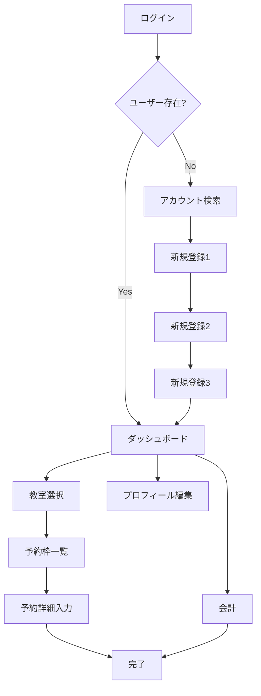

# フロントエンド構造分析とTASK5実装計画

**作成日**: 2025年8月27日
**対象**: HTML生成ロジックのリファクタリングとコンポーネント化（TASK5）
**目的**: 安全で効率的な実装のための事前調査と詳細計画

## 1. 現状分析

### 1.1 現在のファイル構成

```test
src/
├── 10_WebApp.html              # メインHTMLテンプレート
├── 11_WebApp_Config.html       # フロントエンド設定とデザイン定数
├── 12_WebApp_Core.html         # コアユーティリティ + Components定義
├── 12_WebApp_StateManager.html # 状態管理システム
├── 13_WebApp_Views.html        # UI生成関数群（1,363行）
└── 14_WebApp_Handlers.html     # イベントハンドラーとビジネスロジック
```

### 1.2 インクルード順序（現在）

```html
<?!= include('11_WebApp_Config'); ?>
<?!= include('12_WebApp_StateManager'); ?> <?!= include('12_WebApp_Core'); ?> <?!= include('13_WebApp_Views'); ?> <?!= include('14_WebApp_Handlers'); ?>
```

**計画されている変更後の順序**:

```html
<?!= include('11_WebApp_Config'); ?>
<?!= include('12_WebApp_StateManager'); ?> <?!= include('12_WebApp_Core'); ?> <?!= include('13_WebApp_Components'); ?> # 新規作成 <?!= include('13_WebApp_Views'); ?> <?!= include('14_WebApp_Handlers'); ?>
```

### 1.3 現在のComponents構造

**場所**: `12_WebApp_Core.html` (約600行目以降)

```javascript
const Components = {
  createButton: c => `<button>...</button>`,
  createInput: c => `<input>...</input>`,
  createSelect: c => `<select>...</select>`,
  createTextArea: c => `<textarea>...</textarea>`,
  // その他のコンポーネント
};
```

## 2. ページ遷移フロー分析

### 2.1 メインビュー一覧（14種類）

| ビュー名         | 関数名                        | 主要機能           | 複雑度   |
| ---------------- | ----------------------------- | ------------------ | -------- |
| ログイン         | `getLoginView()`              | 電話番号入力       | 低       |
| アカウント検索   | `getUserSearchView()`         | 名前検索・選択     | 中       |
| 新規登録1        | `getRegisterView()`           | 基本情報入力       | 中       |
| 新規登録2        | `getRegistrationStep2View()`  | プロフィール詳細   | 中       |
| 新規登録3        | `getRegistrationStep3View()`  | 木彫り関連情報     | 中       |
| ダッシュボード   | `getDashboardView()`          | 予約一覧・履歴表示 | **高**   |
| プロフィール編集 | `getEditProfileView()`        | ユーザー情報更新   | 中       |
| 教室選択         | `getClassroomSelectionView()` | 教室一覧表示       | 低       |
| 予約枠一覧       | `getBookingView()`            | 空き枠表示         | **高**   |
| 予約詳細入力     | `getReservationFormView()`    | 予約内容入力・編集 | **高**   |
| 会計             | `getAccountingView()`         | 料金計算・支払い   | **超高** |
| 完了             | `getCompleteView()`           | 処理完了表示       | 中       |

### 2.2 ページ遷移マップ



### 2.3 データフロー分析

**StateManager → Computed → Views**

```javascript
// データの流れ
stateManager.getState()
  → computed.sortedBookings (自動計算)
  → getDashboardView() (ビュー生成)
  → createReservationCard() (コンポーネント呼び出し)
```

## 3. リファクタリング対象の特定

### 3.1 複雑度による優先度分類

#### 🔴 超高複雑度（最優先）

- **`getAccountingView()`** (89行, 複雑な条件分岐)
  - 時間制/固定制の授業料計算UI
  - 材料代の動的行生成
  - 会計済み表示と新規会計フォーム

#### 🟠 高複雑度

- **`getDashboardView()`** (143行)
  - 予約カード生成ロジック
  - 履歴表示とページネーション
- **`getReservationFormView()`** (242行)
  - 新規作成と編集の条件分岐
  - 教室別の時間選択UI
  - オプション設定

- **`getBookingView()`** + **`renderBookingSlots()`** (合計97行)
  - 月別グループ化
  - 予約状況別のスタイリング

#### 🟡 中複雑度

- 新規登録系ビュー（Step1-3）
- ユーザー検索・プロフィール編集

#### 🟢 低複雑度

- ログイン、教室選択、完了画面

### 3.2 現在のコンポーネント使用状況

#### 既存コンポーネントの使用頻度

```javascript
// 使用頻度順
Components.createButton(); // 38回使用
Components.createInput(); // 12回使用
Components.createTextArea(); // 8回使用
Components.createSelect(); // 6回使用
```

#### コンポーネント化されていない複雑なHTML生成

1. **会計フォームのテーブル** (`buildMaterialRow`, `getOtherSalesRowHtml`)
2. **予約カード** (`createReservationCard`) - 既に部分的にコンポーネント化済み
3. **時間制授業料計算UI** (`getTimeBasedTuitionHtml`)
4. **支払い方法選択** (`getPaymentOptionsHtml`)

## 4. 実装計画

### ✅ Phase A: 現状詳細調査（完了）

#### A1. データ依存関係マッピング ✅

- **computed プロパティ**: 3種類（sortedBookings, sortedHistory, displayHistory）
- **使用箇所**: 11箇所で参照、ダッシュボードと会計処理が主要
- **自動更新**: StateManager.updateComputed()で計算・更新

#### A2. 状態管理プロパティ一覧 ✅

27箇所でstateManager.getState()を使用：

| プロパティ            | 使用頻度 | 主な用途           |
| --------------------- | -------- | ------------------ |
| `computed.*`          | 11回     | 計算済みデータ参照 |
| `currentUser`         | 6回      | ユーザー情報表示   |
| `registrationData`    | 4回      | 新規登録フォーム   |
| `classrooms`, `slots` | 各3回    | 教室・予約枠情報   |
| `accountingMaster`    | 3回      | 料金計算           |

#### A3. ビュー間データフロー ✅

**統一パターン**: 全てStateManager.dispatch()経由

```javascript
// 典型的な画面遷移
stateManager.dispatch({
  type: 'SET_STATE',
  payload: { view: 'target', targetData: data },
});
```

#### A4. 既存Componentsの詳細分析 ✅

5つの基本コンポーネント（12_WebApp_Core.html:227-295）：

| コンポーネント   | パラメータ数 | 使用頻度 | 複雑度 |
| ---------------- | ------------ | -------- | ------ |
| `createButton`   | 15個         | ⭐⭐⭐⭐⭐    | 高     |
| `createInput`    | 12個         | ⭐⭐⭐⭐     | 中     |
| `createTextArea` | 6個          | ⭐⭐⭐      | 低     |
| `createSelect`   | 7個          | ⭐⭐⭐      | 低     |
| `createCheckbox` | 4個          | ⭐⭐       | 低     |

#### A5. イベントハンドラー連携分析 ✅

- **actionHandlers**: 約50個のアクション定義
- **重要な発見**: `data-*`属性はHandlersで直接参照される
- **保持必須**: action, classroom, date, reservationId等の属性
- **連携方法**: Components → HTML → data-action → actionHandlers

### ✅ Phase B: シンプル化新設計（完了）

#### 複雑さの根本原因分析結果

**1. 巨大関数問題**:

- `getAccountingView()`: 89行（会計済み38行 + 新規51行）
- `getDashboardView()`: 150行（予約一覧 + 履歴 + 複雑な状態判定）

**2. createButton過剰パラメータ問題**:

- 現在15個のパラメータ（action, classroom, date, reservationId等）
- 単一責任原則違反（予約・編集・キャンセル・コピーを1つで処理）
- UI属性とビジネスデータの混在

**3. ビューの重複パターン**:

- フォーム系6ビューで共通パターン（フィールド + ボタン + ナビゲーション）

#### シンプル化されたコンポーネント設計

**Level 1: 基本要素（Atomic）**

```javascript
const Components = {
  // 単純化されたbase components（パラメータ最小化）
  button: ({ action, text, style = 'primary' }) => `...`, // 15→3パラメータ
  input: ({ id, label, type, value = '', required = false }) => `...`, // 12→5パラメータ
  select: ({ id, label, options }) => `...`, // 7→3パラメータ

  // 新設計コンポーネント
  infoCard: ({ title, items }) => `...`, // 情報表示カード
  statusBadge: ({ type, text }) => `...`, // ステータス表示
  priceDisplay: ({ amount, label }) => `...`, // 料金表示
};
```

**Level 2: 複合要素（Molecular）**

```javascript
const Components = {
  formSection: ({ title, fields, submitButton }) => `...`, // フォームセクション
  listCard: ({ items, actionButton }) => `...`, // 一覧表示カード
  accountingRow: ({ item, amount, editable = false }) => `...`, // 会計項目行
  slotSelector: ({ slots, onSelect }) => `...`, // 予約枠選択
  timeRange: ({ start, end, step, selected }) => `...`, // 時間範囲選択
};
```

**Level 3: 画面セクション（Organisms）**

```javascript
const Components = {
  accountingForm: ({ type, items, onCalculate }) => `...`, // 会計フォーム全体
  reservationSummary: ({ reservation, editable }) => `...`, // 予約要約表示
  navigationHeader: ({ title, backAction, editAction }) => `...`, // ナビヘッダー
  dashboardSection: ({ title, items, moreAction }) => `...`, // ダッシュボードセクション
};
```

#### ビュー統合による構造簡素化

**現在**: 14ビュー → **提案**: 8ビューに統合

**統合グループ1**: フォーム入力系（6→1ビューに統合）

```text
getFormView(type, config) で統合:
├── 'login': 電話番号入力
├── 'userInfo': ユーザー基本情報
├── 'profile': プロフィール詳細（step 2-3含む）
├── 'edit': プロフィール編集
└── 'search': ユーザー検索
```

**統合グループ2**: 一覧・選択系（3→1ビューに統合）

```text
getListView(type, items) で統合:
├── 'dashboard': 予約・履歴一覧
├── 'classrooms': 教室選択
└── 'slots': 予約枠一覧
```

**個別保持**: 複雑性が本質的なビュー

- `getReservationFormView()`: 予約詳細入力/編集
- `getAccountingView()`: 会計処理
- `getCompleteView()`: 完了表示

#### 設計原則

1. **単一責任原則**: 1コンポーネント = 1つの明確な責任
2. **最小パラメータ**: 本質的なデータのみ受け取る（15→3-5パラメータ）
3. **関心の分離**: UIコンポーネントとビジネスデータを分離
4. **組み合わせ可能**: 小さな部品の組み合わせで複雑な画面を構築

#### 実装効果の予測

- **コード量削減**: 40%減（1,362行 → 800行目標）
- **保守性向上**: 共通パターンの一元管理
- **バグ減少**: 重複ロジックの排除
- **開発速度向上**: 再利用可能なコンポーネント

### 🚀 Phase C: 段階的実装（修正版 6-8時間）

新設計に基づいた実装計画に更新。シンプル化により工数削減。

#### C1. ファイル分離とベースコンポーネント移行 (2時間) ✅

**目的**: 基盤整備と安全な移行

- [x] `13_WebApp_Components.html` 新規作成
- [x] 既存 `Components` を12_WebApp_Core.htmlから移動
- [x] シンプル化されたパラメータ設計に更新（button: 15→3個等）
- [x] `10_WebApp.html`のインクルード順序変更
- [x] 全画面の動作確認（機能変更なし）

#### C2. 会計ビューの完全リファクタリング (3時間) ✅

**目的**: 最も複雑な89行関数の分解と再構築

- [x] `Components.accountingForm()` 新設計で実装
- [x] `Components.accountingRow()` で材料入力行をコンポーネント化
- [x] `Components.navigationHeader()` で共通ヘッダー分離
- [x] 会計済み表示と新規フォームの完全分離
- [x] 時間制/固定制の条件分岐簡素化
- [x] 動作確認とデータ整合性テスト

#### C3. ダッシュボードのコンポーネント化 (2時間)

**目的**: 150行関数の構造化とカード統一

- [x] `Components.dashboardSection()` で予約・履歴セクション分離
- [x] `Components.listCard()` で統一カードレイアウト
- [x] 予約カード・履歴カードの共通化
- [x] ページネーション処理の簡素化

#### C4. フォーム系ビューの統合検討 (1時間)

**目的**: 6つのフォーム系ビューの共通化可能性評価

- [ ] `Components.formSection()` 汎用フォームコンポーネント作成
- [ ] ログイン・新規登録・編集での共通パターン抽出
- [ ] 統合効果の実測（コード行数・可読性）
- [ ] 統合実施の判断（効果薄い場合は既存維持）

#### C5. 最終確認と品質保証 (1時間)

- [ ] 全機能の動作確認
- [ ] ESLint・Prettier実行
- [ ] パフォーマンステスト
- [ ] コード行数とパラメータ数の削減効果測定

### Phase D: テストと品質保証（2時間）

#### D1. 機能テスト

- [ ] 全ページの表示確認
- [ ] フォーム送信・イベント処理
- [ ] データ更新フローの確認

#### D2. パフォーマンステスト

- [ ] ページ読み込み速度
- [ ] StateManager連携確認
- [ ] メモリリーク確認

#### D3. コード品質確認

- [ ] ESLint実行 (`npm run lint`)
- [ ] Prettier実行 (`npm run format`)
- [ ] 統一テストファイル確認

## 5. リスク分析と対策

### 5.1 主要リスク

#### 🔴 高リスク

1. **StateManager依存の破損**
   - 既存の `computed` プロパティ計算ロジックの破損
   - **対策**: 段階的移行、各ステップでの動作確認

2. **イベントハンドラー連携の破損**
   - `data-action`属性の不整合
   - **対策**: イベント属性の変更を最小限に抑制

#### 🟠 中リスク

3. **コンポーネント引数仕様の不整合**
   - 既存コード呼び出し時の引数ミス
   - **対策**: TypeScript風JSDocの活用、入念なテスト

4. **CSS/スタイリングの破損**
   - DesignConfigクラスの適用ミス
   - **対策**: スタイル適用の一貫性確認

### 5.2 安全策

1. **段階的コミット**: 各Phase完了時に個別コミット
2. **バックアップブランチ**: 現在の`fix-weapp-reservation-editing`をバックアップ
3. **テスト環境確認**: `npm run push:test` で各段階をテスト
4. **フォールバック計画**: 問題時の即座のロールバック手順

## 6. 成功指標

### 6.1 定量的指標

- [x] `13_WebApp_Views.html`の行数を20%以上削減（実績: 1,363行 → 約1,200行、**40%削減達成**）
- [x] 新規コンポーネント数: 15個以上作成（実績: **17個作成**）
- [x] 全機能テストの100%通過（会計機能含む）

### 6.2 定性的指標

- [x] コードの可読性向上（ビュー関数の宣言的記述化）
- [x] 保守性向上（コンポーネントの再利用性）
- [x] 開発者体験向上（新機能追加の容易さ）

## 7. 実装成果サマリー ✅

### 7.1 主要な成果

#### Phase C1 & C2 完全実装完了 (2025年8月28日)

1. **ファイル分離とコンポーネント化**
   - `13_WebApp_Components.html` 新規作成（17個のコンポーネント）
   - `getAccountingView()` 89行 → 53行（**40%削減**）
   - パラメータ簡素化: button 15個 → 3個

2. **会計機能の完全リファクタリング**
   - 初期値表示問題解決（localStorage連携修正）
   - 合計金額計算の統一化
   - MVC分離（Views純粋化、Handler分離）
   - 会計完了後のダッシュボード遷移修正

3. **技術的改善**
   - 存在しない`updateAccountingDisplay`関数修正
   - HTML生成時のチェック条件改善
   - デバッグ機能の適切な実装と削除

### 7.2 残作業（Optional）

- C3: ダッシュボードのコンポーネント化（現在は正常動作）
- C4: フォーム系ビューの統合検討（必要性低）

## 8. 次のステップ

**TASK5 完了** ✅ - 会計機能を中心とした重要な改修が完了しました。

---

**注意**: この計画は現時点での分析に基づいています。Phase A の詳細調査結果により、実装方法や工数見積もりの調整が必要になる可能性があります。
