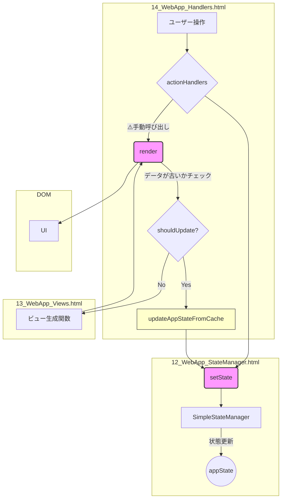
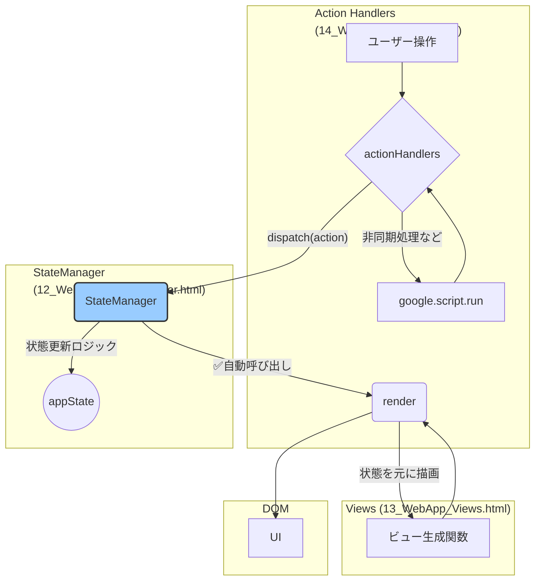

# フロントエンド アーキテクチャ設計書

## 1. はじめに

このドキュメントは、予約管理システム「きぼりの よやく・きろく」のフロントエンドアーキテクチャについて、現状の構造（As-Is）と、目指すべき理想的な構造（To-Be）を定義するものです。

**目的**:

- 現状の課題を明確にする。
- 保守性、拡張性、安定性の高いアーキテクチャへの移行パスを示す。
- 開発者間の共通認識を形成し、開発効率を向上させる。

---

## 2. 現状のアーキテクチャ (As-Is)

現在のフロントエンドは、機能ごとにファイルが分割されていますが、状態管理とUI描画の連携に課題を抱えています。

### 2.1. ファイル構成

- **`10_WebApp.html`**: メインHTMLテンプレート
- **`11_WebApp_Config.html`**: 静的な設定とスタイル
- **`12_WebApp_Core.html`**: 汎用ユーティリティ、コンポーネント生成
- **`12_WebApp_StateManager.html`**: 状態管理クラス (`SimpleStateManager`)
- **`13_WebApp_Views.html`**: 各画面のHTML生成ロジック
- **`14_WebApp_Handlers.html`**: イベントハンドラ、サーバー通信、画面描画のトリガー

### 2.2. データフローと課題

現在のデータフローは以下のようになっています。

#### 🔴 主要な問題点

1. **状態更新とUI描画の分離**:
    - `setState()` を呼び出しても、UIは自動で更新されません。
    - 開発者は `render()` を**手動で**呼び出す必要があり、呼び出し忘れによる「画面が更新されない」バグの原因となります。

2. **責務の混在**:
    - `render()` 関数 (`14_WebApp_Handlers.html`) が、UI描画だけでなく、**データ取得の要否判定と実行** (`shouldUpdateAppStateForView`, `updateAppStateFromCache`) という副作用も担っています。
    - これにより `render()` が意図せず複数回 `setState` を呼び出し、処理が複雑化しています。

3. **複雑なデータ鮮度管理**:
    - `isDataFresh` や `_dataUpdateInProgress` といったフラグを用いてデータの鮮度を管理していますが、このロジックが `render()` 関数内に存在するため、フローが追いにくく、バグの温床となっています。

---

## 3. あるべきアーキテクチャ (To-Be)

目指すのは、**単一方向データフロー (Unidirectional Data Flow)** を徹底した、予測可能で堅牢なアーキテクチャです。

### 3.1. 設計思想

- **状態管理の一元化**: `StateManager` が状態の更新とUI描画のトリガーの両方に責任を持つ。
- **関心の分離**: 各コンポーネントは単一の責務に集中する。
  - **Action Handlers**: ユーザー操作の受付、非同期処理、アクションの発行。
  - **StateManager**: 状態の更新と、UI描画のトリガー。
  - **Views / Render**: 状態を元にしたUIの描画のみ。
- **宣言的なUI更新**: `setState` を呼び出せば、UIは**必ず自動で**最新の状態を反映する。

### 3.2. 新しいデータフロー

### 3.3. 各コンポーネントの責務

| コンポーネント      | 責務                                                                                         | 禁止事項                                 |
| ------------------- | -------------------------------------------------------------------------------------------- | ---------------------------------------- |
| **Action Handlers** | ユーザー操作の受付、サーバー通信 (`google.script.run`)、`stateManager.dispatch` の呼び出し。 | DOMの直接操作、`render` の直接呼び出し。 |
| **StateManager**    | `dispatch` されたアクションに基づき `appState` を更新し、**自動で `render` を呼び出す**。    | 非同期処理、DOM操作。                    |
| **Views**           | `appState` を引数に取り、対応するHTML文字列を返す純粋な関数。                                | 状態の変更、副作用のある処理。           |
| **Render Function** | `StateManager` から呼び出され、現在の `appState.view` に基づいてビューをDOMに描画する。      | データ取得、状態変更。                   |

### 3.4. 改善によるメリット

- **バグの減少**: `render()` の呼び出し忘れがなくなり、UIと状態の不整合が根本的になくなる。
- **可読性の向上**: データフローが単一方向で予測可能になるため、コードが追いやすくなる。
- **保守性の向上**: 各モジュールの責務が明確になり、機能追加や修正が容易になる。
- **テストの容易化**: 副作用のないビュー関数など、ユニットテストがしやすい構造になる。

---

## 4. 移行計画

以下のステップで段階的にリファクタリングを進めます。

1. **Step 1: `StateManager` の強化**
    - `dispatch` メソッドを導入し、状態更新と `render` の自動呼び出しを実装する。
    - グローバルな `setState` を、この新しい `dispatch` を呼び出すラッパーに変更する。

2. **Step 2: `render` 関数の責務分離**
    - `render` 関数からデータ取得ロジック (`updateAppStateFromCache` など) を完全に削除し、描画に専念させる。

3. **Step 3: データ取得ロジックの移譲**
    - `render` から削除したデータ取得ロジックを、`goToDashboard` などの画面遷移を担当する `actionHandlers` に移譲する。

4. **Step 4: グローバル変数の削減**
    - `window.C` や `window.STATUS` などのグローバル定数を `appState.constants` 経由で参照するように段階的に修正する。
