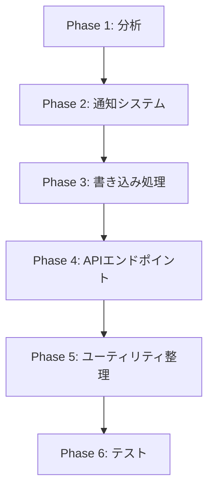

# reservation.user利用前提のバックエンドリファクタリング計画

## 概要

`ReservationCore`型に`user`プロパティが自動付与されるようになったことを活用し、バックエンド全体を`reservation.user`利用前提の構造に組み替える。

## 現状分析

### 実装済み

- ✅ `ReservationCore`型に`user?: UserCore`を追加
- ✅ `transformReservationArrayToObjectWithHeaders()`でユーザー情報自動付与
- ✅ すべての予約変換処理で`user`が利用可能

### 現在の問題点

- ❌ `studentId`から別途ユーザー情報を取得する処理が散在
- ❌ `reservation.user`を使わず`studentId`で検索する非効率なコード
- ❌ ユーザー情報取得の重複ロジック

## リファクタリング計画

### Phase 1: コード分析と影響範囲の特定

#### 1.1 ユーザー情報取得パターンの洗い出し

```bash
# 検索対象パターン
- getCachedData(CACHE_KEYS.ALL_STUDENTS_BASIC)
- studentsCache.students[studentId]
- getStudentWithEmail(studentId)
- authenticateUser()でのユーザー取得
```

**タスク:**

- [ ] バックエンド全ファイルでユーザー情報取得箇所を特定
- [ ] 各箇所で`reservation.user`に置き換え可能か判定
- [ ] 影響範囲マップを作成

**期待される対象ファイル:**

- `02-5_Notification_StudentSchedule.js` - スケジュール通知
- `02-6_Notification_Admin.js` - 管理者通知
- `02-7_Notification_StudentReservation.js` - 予約通知
- `04_Backend_User.js` - ユーザー認証・管理
- `05-2_Backend_Write.js` - 予約書き込み処理
- `09_Backend_Endpoints.js` - API統合エンドポイント

#### 1.2 パターン分類

| パターン     | 現在の実装                            | リファクタリング後            | 優先度 |
| ------------ | ------------------------------------- | ----------------------------- | ------ |
| **通知処理** | `studentId` → `getStudentWithEmail()` | `reservation.user` 直接利用   | 🔴 高  |
| **予約検証** | `studentId` → キャッシュ検索          | `reservation.user` 参照       | 🟡 中  |
| **API応答**  | 別途ユーザー情報構築                  | `reservation.user` 含めて返却 | 🟢 低  |

### Phase 2: 通知システムのリファクタリング（優先度：高）

#### 2.1 スケジュール通知 (`02-5_Notification_StudentSchedule.js`)

**現状:**

```javascript
// 予約取得後、別途ユーザー情報を取得
const reservations = getUserReservations(student.studentId);
const user = getStudentWithEmail(student.studentId);
sendEmail(user.email, ...);
```

**リファクタリング後:**

```javascript
// reservation.userを直接利用
const reservations = getUserReservations(student.studentId);
reservations.forEach(reservation => {
  if (reservation.user?.email) {
    sendEmail(reservation.user.email, ...);
  }
});
```

**タスク:**

- [ ] `sendScheduleNotification()`関数を修正
- [ ] `getStudentWithEmail()`呼び出しを削除
- [ ] `reservation.user`利用に切り替え
- [ ] テスト実施

#### 2.2 予約通知 (`02-7_Notification_StudentReservation.js`)

**現状:**

```javascript
// studentIdから別途ユーザー情報を取得
const user = getStudentWithEmail(reservation.studentId);
sendReservationEmail(user, reservation);
```

**リファクタリング後:**

```javascript
// reservation.userを直接利用
if (reservation.user?.email && reservation.user?.wantsEmail) {
  sendReservationEmail(reservation);
}
```

**タスク:**

- [ ] 予約確認メール送信処理を修正
- [ ] キャンセル通知処理を修正
- [ ] 関数シグネチャを簡素化（`user`引数を削除）

#### 2.3 管理者通知 (`02-6_Notification_Admin.js`)

**タスク:**

- [ ] 管理者向けメール本文でユーザー情報表示箇所を確認
- [ ] `reservation.user`利用に切り替え

### Phase 3: 予約書き込み処理のリファクタリング（優先度：中）

#### 3.1 予約作成処理 (`05-2_Backend_Write.js`)

**現状の課題:**

```javascript
// 予約作成時にstudentIdしか持たない
makeReservation(reservationDto);
// 後続処理でユーザー情報が必要な場合、再取得が発生
```

**リファクタリング後:**

```javascript
// 作成した予約を取得し、reservation.userを活用
const result = makeReservation(reservationDto);
const reservation = result.data.reservation; // user付き
if (reservation.user?.wantsEmail) {
  sendConfirmationEmail(reservation);
}
```

**タスク:**

- [ ] `makeReservation()`戻り値に作成した予約を含める
- [ ] 通知処理で`reservation.user`を直接利用
- [ ] 初回フラグチェック処理の簡素化

#### 3.2 予約更新・キャンセル処理

**タスク:**

- [ ] `updateReservationDetails()`でユーザー情報取得を削除
- [ ] `cancelReservation()`でユーザー情報取得を削除
- [ ] 戻り値の予約オブジェクトから直接ユーザー情報を参照

### Phase 4: APIエンドポイントの最適化（優先度：低）

#### 4.1 統合ログインAPI (`09_Backend_Endpoints.js`)

**現状:**

```javascript
function getLoginData(phone) {
  const user = authenticateUser(phone);
  const reservations = getUserReservations(user.studentId);
  return { user, data: { myReservations: reservations } };
}
```

**リファクタリング後:**

```javascript
function getLoginData(phone) {
  const user = authenticateUser(phone);
  const reservations = getUserReservations(user.studentId);
  // reservations[].userは既に設定済み
  // 必要に応じてuser情報の整合性チェック
  return { user, data: { myReservations: reservations } };
}
```

**タスク:**

- [ ] 重複するユーザー情報構築ロジックを削除
- [ ] `reservation.user`の整合性チェック追加（オプション）

#### 4.2 予約操作統合API

**タスク:**

- [ ] `executeOperationAndGetLatestData()`でユーザー情報取得を削除
- [ ] 戻り値の予約配列が`user`を含むことを前提に最適化

### Phase 5: ユーティリティ関数の整理

#### 5.1 削除候補関数の特定

**検討対象:**

```javascript
// これらの関数が不要になる可能性
-getStudentWithEmail(studentId) - // reservation.userで代替
  getStudentBasicInfo(studentId); // reservation.userで代替
```

**タスク:**

- [ ] 各関数の利用箇所を確認
- [ ] `reservation.user`で代替可能な箇所を特定
- [ ] 段階的に削除または非推奨化

#### 5.2 新規ヘルパー関数の追加（オプション）

**検討案:**

```javascript
/**
 * 予約にユーザー情報が付与されているか確認
 * @param {ReservationCore} reservation
 * @returns {boolean}
 */
function hasUserInfo(reservation) {
  return reservation?.user?.studentId != null;
}

/**
 * メール通知可能な予約か確認
 * @param {ReservationCore} reservation
 * @returns {boolean}
 */
function canSendEmail(reservation) {
  return reservation?.user?.email && reservation?.user?.wantsEmail;
}
```

### Phase 6: テストとバリデーション

#### 6.1 単体テスト

- [ ] 各リファクタリング箇所の動作確認
- [ ] エッジケース（user未設定時）のハンドリング確認

#### 6.2 統合テスト

- [ ] ログイン → 予約作成 → 通知送信の一連フロー確認
- [ ] 予約更新・キャンセル時の通知確認
- [ ] スケジュール通知の動作確認

#### 6.3 パフォーマンス検証

- [ ] キャッシュアクセス回数の削減を確認
- [ ] API応答時間の改善を測定

## 実装順序（推奨）



### Week 1-2: Phase 1-2

1. コード分析と影響範囲特定
2. 通知システムのリファクタリング
3. 通知機能のテスト

### Week 3: Phase 3

1. 予約書き込み処理の最適化
2. 予約操作のテスト

### Week 4: Phase 4-5

1. APIエンドポイントの整理
2. ユーティリティ関数の整理

### Week 5: Phase 6

1. 統合テストとバリデーション
2. パフォーマンス測定と最適化

## 期待される効果

### コード品質

- ✅ **重複コード削減**: ユーザー情報取得ロジックの一元化
- ✅ **可読性向上**: `reservation.user.displayName`の直感的なアクセス
- ✅ **保守性向上**: データ取得処理の一貫性

### パフォーマンス

- ✅ **キャッシュアクセス削減**: 既に付与された`user`を再利用
- ✅ **API呼び出し削減**: 別途ユーザー情報取得が不要
- ✅ **応答時間短縮**: 無駄な処理の削減

### 型安全性

- ✅ **型推論の向上**: `reservation.user.email`で自動補完
- ✅ **null安全性**: `reservation.user?.email`でのオプショナルチェイン
- ✅ **データ整合性**: `studentId`と`user`の不一致リスク低減

## リスクと対策

### リスク1: user未設定の予約が存在

**対策:**

- `transformReservationArrayToObjectWithHeaders()`で必ず設定
- エッジケースでのフォールバック処理を実装
- `user`が`undefined`の場合のログ出力

### リスク2: 既存の動作への影響

**対策:**

- 段階的なリファクタリング（Phase単位）
- 各Phase完了時に十分なテスト
- ロールバック可能な実装方法

### リスク3: メモリ使用量の微増

**影響度: 極小**

- ユーザー情報は参照で共有されるため、実質的な増加は数KB程度
- CacheServiceの分割システム（v5.5）で既に100KB制限に対応済み
- むしろ重複キャッシュアクセスが削減され、**パフォーマンス改善が期待される**

**対策:**

- 不要（現状の実装で十分）
- 念のためメモリ使用量を監視（オプション）

## 完了基準

- [ ] すべてのユーザー情報取得が`reservation.user`経由
- [ ] 重複するユーザー取得ロジックが削除済み
- [ ] 全通知機能が正常動作
- [ ] パフォーマンス劣化なし（むしろ改善）
- [ ] 型チェックエラーなし
- [ ] ドキュメント更新完了

## 参考資料

- [型システム統一ドキュメント](TYPE_SYSTEM_UNIFICATION.md)
- [データモデル設計](DATA_MODEL.md)
- [ReservationCore型定義](../types/core/reservation.d.ts)
- [UserCore型定義](../types/core/user.d.ts)
