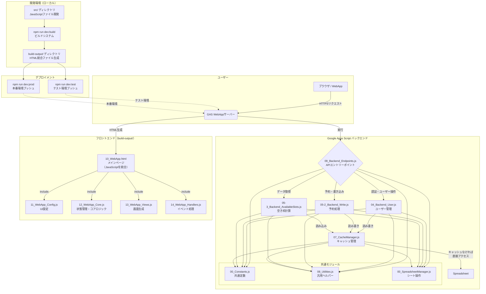
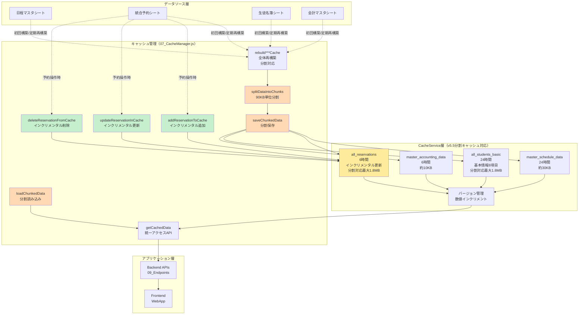
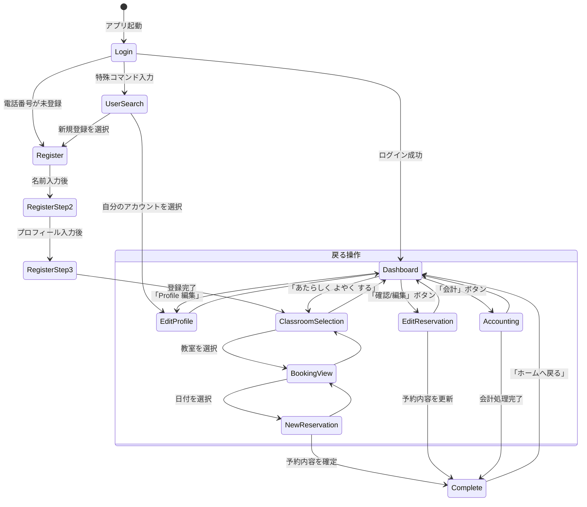
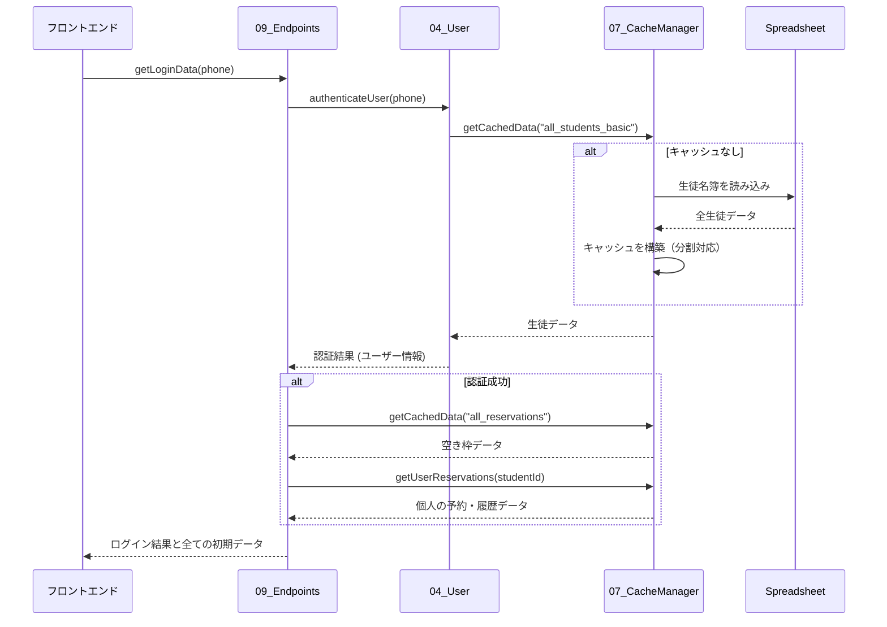
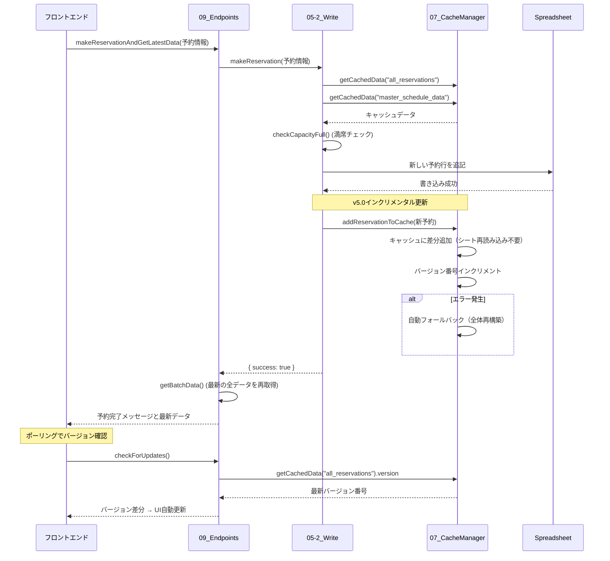
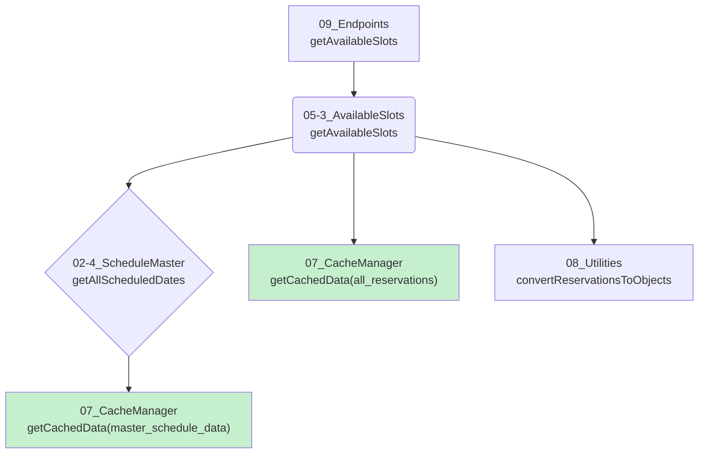
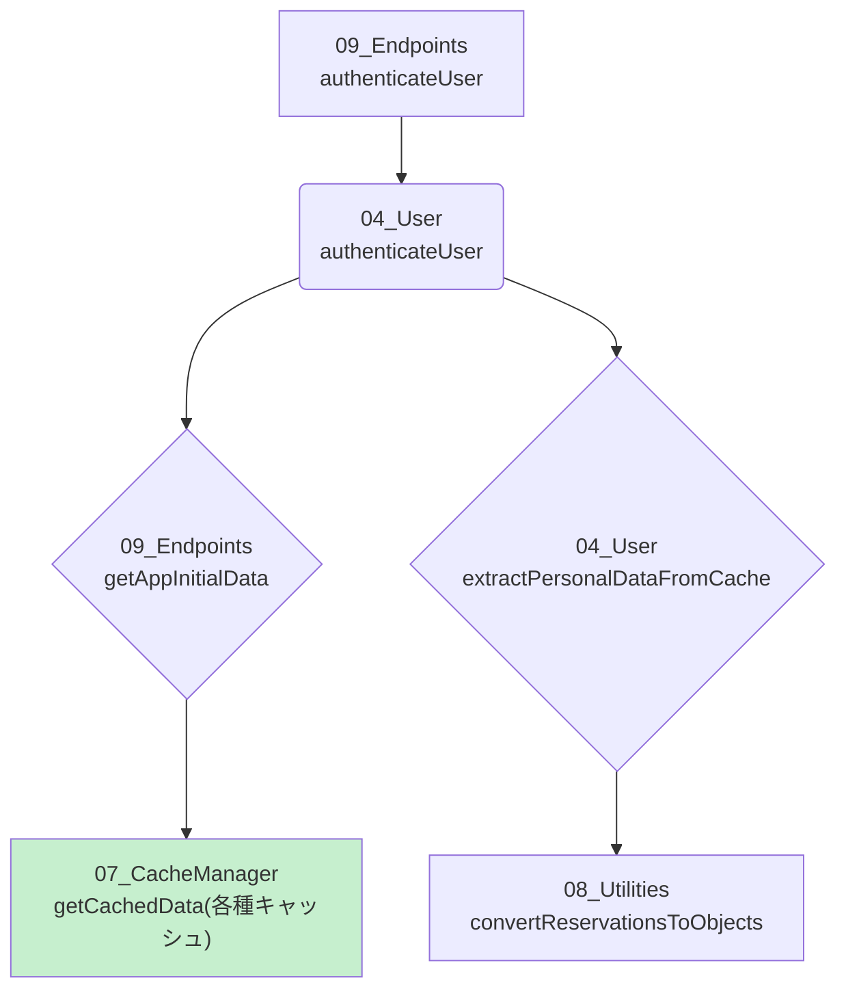
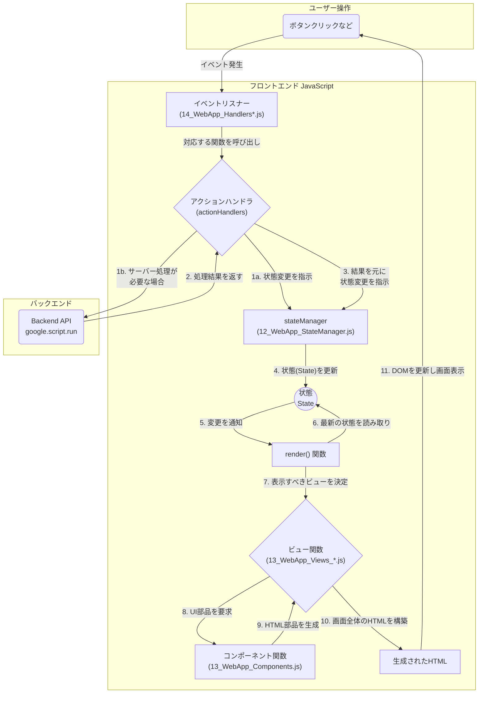

# システムアーキテクチャ図（v3.2対応）

**最終更新**: 2025年10月2日 | **対象バージョン**: v3.2.0

## はじめに

このドキュメントは、プロジェクトの全体像を視覚的に理解するために、主要な設計要素とデータフローを図で示します。

- **プロジェクト構造**: 主要なファイル群とそれらの役割・依存関係
- **開発ワークフロー**: JavaScript分離開発アーキテクチャ（src/ → build-output/）
- **キャッシュ層アーキテクチャ**: インクリメンタル更新と分割キャッシュシステム
- **画面遷移図**: Webアプリのユーザーインターフェースの遷移
- **データフロー図**: ユーザー操作に応じたバックエンドでのデータ処理の流れ
- **主要機能の関連図**: バックエンドの主要機能間の呼び出し関係
- **フロントエンドアーキテクチャ**: フロントエンドの状態管理と画面描画の仕組み

## プロジェクト構造図（v3.2対応）

プロジェクトを構成する主要なコンポーネントと、JavaScript分離開発アーキテクチャを示します。



### ファイル構造の詳細

**開発ディレクトリ（src/）**:

```text
src/
├── backend/                        # バックエンドロジック
│   ├── 00_Constants.js            # グローバル定数・設定
│   ├── 00_SpreadsheetManager.js   # スプレッドシート操作管理
│   ├── 01_Code.js                 # エントリーポイント・トリガー
│   ├── 02-5_BusinessLogic_Notification.js  # 通知ロジック
│   ├── 04_Backend_User.js         # ユーザー認証・管理
│   ├── 05-2_Backend_Write.js      # データ書き込みAPI
│   ├── 05-3_Backend_AvailableSlots.js  # 空き枠計算API
│   ├── 07_CacheManager.js         # キャッシュ管理
│   ├── 08_ErrorHandler.js         # エラーハンドリング
│   ├── 08_Utilities.js            # 汎用ユーティリティ
│   └── 09_Backend_Endpoints.js    # 統一APIエンドポイント
├── frontend/                       # フロントエンドロジック
│   ├── 11_WebApp_Config.js        # フロントエンド設定・デザイン定数
│   ├── 12_WebApp_Core.js          # コアユーティリティ
│   ├── 12_WebApp_Core_*.js        # コアモジュール群
│   ├── 12_WebApp_StateManager.js  # State管理
│   ├── 13_WebApp_Components.js    # UIコンポーネント
│   ├── 13_WebApp_Views_*.js       # ビュー生成モジュール
│   └── 14_WebApp_Handlers*.js     # イベントハンドラー
└── templates/
    └── 10_WebApp.html             # HTMLテンプレート

build-output/                       # デプロイ対象（自動生成）
└── [上記ファイルがビルドされたもの]
```

**開発ワークフローの重要な注意事項**:

1. **開発作業は必ず `src/` ディレクトリで実施**
2. **`build-output/` ディレクトリのファイルは絶対に直接編集禁止**（ビルド時に上書きされる）
3. **修正後は必ず `npm run dev:build` でbuild-outputに反映**
4. **テスト**: `npm run dev:test` でテスト環境に自動プッシュ＆確認
5. **本番**: `npm run dev:prod` で本番デプロイ

## キャッシュ層アーキテクチャ（v5.0-5.5対応）

新しいキャッシュシステムの全体像を示します。



### キャッシュシステムの特徴

**インクリメンタル更新システム（v5.0）**:

- **差分更新**: シート全体を再読み込みせず、変更部分のみ更新
- **パフォーマンス**: 2-3秒 → 50-200ms（95%以上の高速化）
- **自動フォールバック**: エラー時は全体再構築に自動切り替え
- **バージョン管理**: 数値インクリメントで効率的な差分検出

**分割キャッシュシステム（v5.5）**:

- **自動分割**: データが90KB超過時に自動チャンク分割
- **最大容量**: 20チャンクまで対応（合計1.8MB）
- **透過的操作**: アプリケーション層は分割を意識不要
- **CacheService制限解決**: 100KB制限問題を根本解決

**時間主導型トリガー**:

- **6時間ごと**: 全キャッシュの自動再構築
- **安定性向上**: キャッシュ有効期限切れを事前に防止
- **高可用性**: Googleの自動削除に対する耐性

## 画面遷移図

ユーザーがWebアプリケーションをどのように操作し、画面が遷移していくかを示します。



## データフロー図

主要な操作における、フロントエンドとバックエンド間のデータの流れを時系列で示します。

### ログイン処理（キャッシュ統合版）

ユーザーが電話番号でログインする際のデータフローです。



### 予約作成処理（インクリメンタル更新版）

ユーザーが新しい予約を入れる際のデータフローです。



## 主要機能の関連図

バックエンドにおける主要なビジネスロジック間の呼び出し関係を示します。

### 空き枠計算 (`getAvailableSlots`)



### ユーザー認証 (`authenticateUser`)



## フロントエンド アーキテクチャ

フロントエンドは「**状態管理 (State Management)**」モデルに基づいて構築されています。ユーザーの操作によって「状態」が変更され、その変更を検知して画面が自動的に再描画される、という一方向のデータフローを特徴とします。

これにより、UIの整合性を保ちやすく、予測可能な動作を実現しています。



### フロントエンドの責任分離

1. **ユーザー操作**: ユーザーがボタンをクリックするなど、何らかのアクションを起こします。
2. **イベントリスナー**: `14_WebApp_Handlers*.js` にあるイベントリスナーがその操作を検知し、対応する `actionHandlers` の関数を呼び出します。
3. **アクションハンドラ**: 呼び出された関数は、必要に応じてバックエンドAPI (`google.script.run`) を呼び出すか、または直接 `stateManager` に状態の変更を依頼 (dispatch) します。
4. **状態更新**: `stateManager` (`12_WebApp_StateManager.js`) がアプリケーションの唯一の「状態 (State)」を更新します。
5. **再描画**: 状態が変更されると、`stateManager` は `render()` 関数に「状態が変わった」ことを通知します。
6. **画面構築**: `render()` 関数は、最新の状態を元に、`13_WebApp_Views_*.js` のビュー関数を呼び出して画面全体のHTMLを再構築します。
7. **DOM更新**: 新しく構築されたHTMLで、実際の画面が更新されます。

このサイクルにより、データと表示の一貫性が保たれます。

### フロントエンド設計原則

**Atomic Design + StateManager**:

- **Atomic Components**: `13_WebApp_Components.js` - 再利用可能な小部品
- **Views**: `13_WebApp_Views_*.js` - 純粋な表示ロジック（状態を読むのみ）
- **Handlers**: `14_WebApp_Handlers*.js` - ビジネスロジックとstate更新の調整
- **StateManager**: `12_WebApp_StateManager.js` - 唯一の状態管理責任

**単方向データフロー**:

```text
ユーザー操作 → Handlers → dispatch() → StateManager
    ↓
State更新 → render()呼び出し
    ↓
Views → Components → DOM更新 → 画面表示
```

## システム最適化の成果（v3.2時点）

### パフォーマンス改善

| 指標               | 改善前     | 改善後       | 改善率    |
| ------------------ | ---------- | ------------ | --------- |
| 予約表示速度       | 5-10秒     | 0.5-1秒      | 90%+      |
| 予約更新速度       | 2-3秒      | 50-200ms     | 95%+      |
| サーバー負荷       | 高         | 低           | 80%削減   |
| キャッシュ容量     | 不安定     | 140KB        | 最適化    |
| スケーラビリティ   | 限定的     | 最大1.8MB    | 大幅向上  |
| リアルタイム性     | なし       | ポーリング   | 新機能    |

### アーキテクチャ改善

**データモデル**:

- 教室別分散シート → 統合予約シート（単一ソース）
- 重複データ排除 → 正規化された構造
- シート数削減 → 運用・保守の簡素化

**キャッシュシステム**:

- 静的キャッシュ → インクリメンタル更新（v5.0）
- 100KB制限問題 → 分割キャッシュで解決（v5.5）
- 手動管理 → 自動再構築（時間主導型トリガー）

**開発環境**:

- HTML内JavaScript → JavaScript分離開発（2025年9月）
- 手動ビルド → 自動ビルドシステム
- 環境手動切り替え → 環境自動判定

## 開発ワークフロー（v3.2対応）

### 推奨開発フロー

1. **開発**: `src/backend/` または `src/frontend/` でコード編集
2. **ビルド**: `npm run dev:build` で変更を `build-output/` に反映
3. **品質チェック**: `npm run check` でフォーマット・lint・型チェック
4. **テスト**: `npm run dev:test` でテスト環境に自動プッシュ＆確認
5. **本番**: `npm run dev:prod` で本番デプロイ（テストOK後のみ）

### 重要な開発ルール

1. **🚨 NEVER EDIT `build-output/` FILES**: 必ず `src/` で開発
2. **BUILD REQUIRED**: `src/` 編集後は必ず `npm run dev:build`
3. **QUALITY FIRST**: コミット前に `npm run check` を実行
4. **TEST BEFORE PROD**: 本番デプロイ前に必ずテスト環境で確認

## 参考ドキュメント

- [データモデル設計仕様書](DATA_MODEL.md) - バックエンドデータ構造とキャッシュシステムの詳細
- [State管理ガイド](STATE_MANAGEMENT_GUIDE.md) - フロントエンドState管理の完全仕様
- [JavaScript分離開発アーキテクチャ](JS_TO_HTML_ARCHITECTURE.md) - ビルドシステムと開発ワークフロー
- [CLAUDE.md](../CLAUDE.md) - プロジェクト全体のガイドライン

---

**作成日**: 2024年初版
**最終更新**: 2025年10月2日
**対象バージョン**: v3.2.0
**ステータス**: 実装完了・運用中
