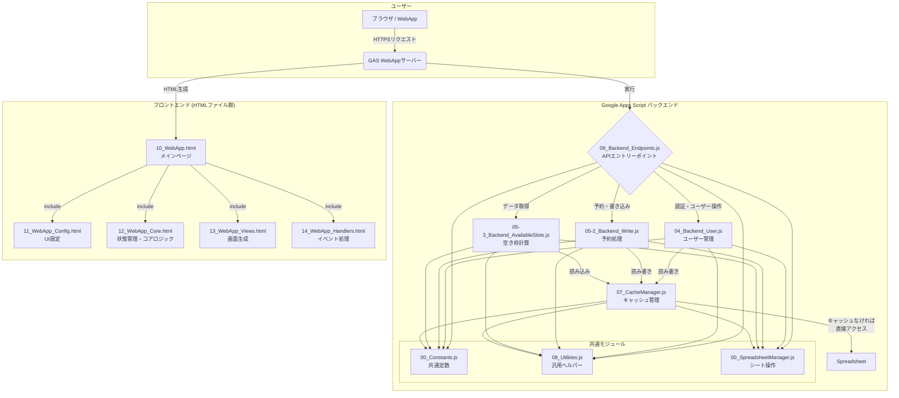
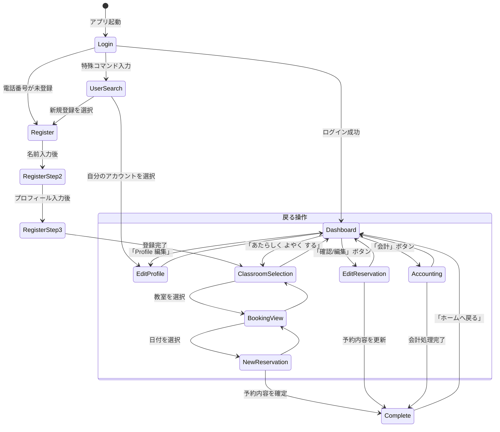
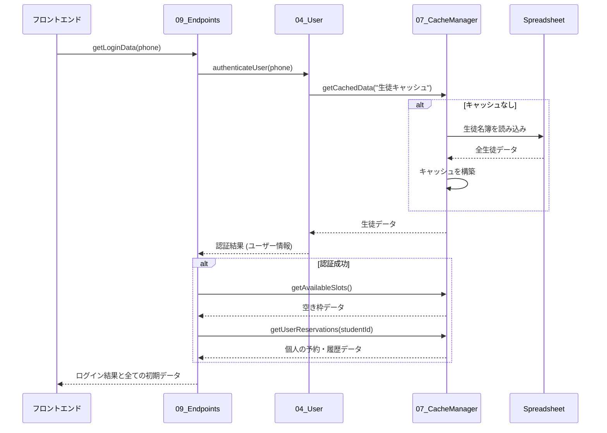
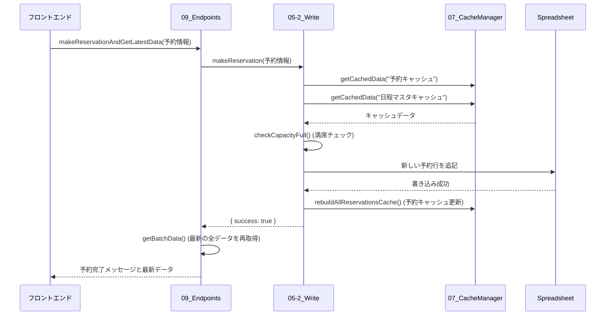
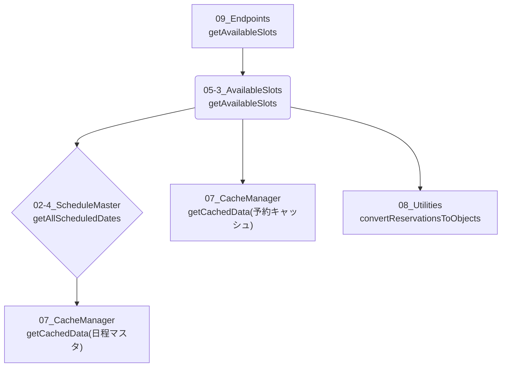
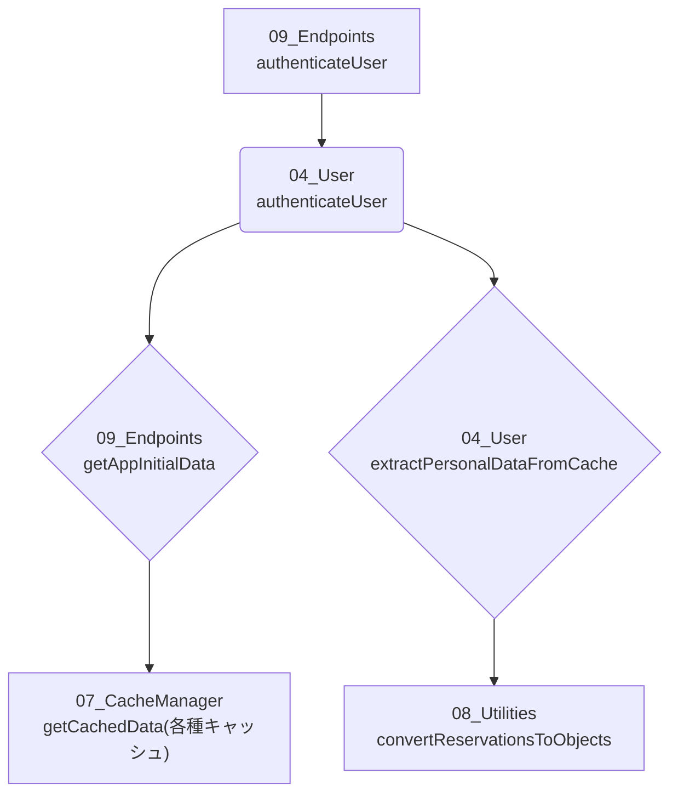
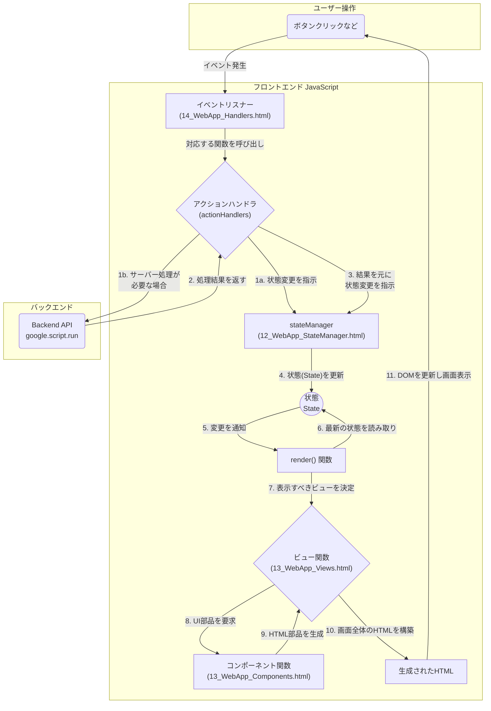

# システム設計とデータフロー

## 1. はじめに

このドキュメントは、プロジェクトの全体像を視覚的に理解するために、主要な設計要素とデータフローを図で示します。

- **プロジェクト構造**: 主要なファイル群とそれらの役割・依存関係
- **画面遷移図**: Webアプリのユーザーインターフェースの遷移
- **データフロー図**: ユーザー操作に応じたバックエンドでのデータ処理の流れ
- **主要機能の関連図**: バックエンドの主要機能間の呼び出し関係
- **フロントエンドアーキテクチャ**: フロントエンドの状態管理と画面描画の仕組み

## 2. プロジェクト構造図

プロジェクトを構成する主要なコンポーネントと、それらの基本的な依存関係を示します。

## 3. 画面遷移図

ユーザーがWebアプリケーションをどのように操作し、画面が遷移していくかを示します。

## 4. データフロー図

主要な操作における、フロントエンドとバックエンド間のデータの流れを時系列で示します。

### 4.1. ログイン処理

ユーザーが電話番号でログインする際のデータフローです。

### 4.2. 予約作成処理

ユーザーが新しい予約を入れる際のデータフローです。

## 5. 主要機能の関連図

バックエンドにおける主要なビジネスロジック間の呼び出し関係を示します。

### 5.1. 空き枠計算 (`getAvailableSlots`)

### 5.2. ユーザー認証 (`authenticateUser`)

## 6. フロントエンド アーキテクチャ

フロントエンドは「**状態管理 (State Management)**」モデルに基づいて構築されています。ユーザーの操作によって「状態」が変更され、その変更を検知して画面が自動的に再描画される、という一方向のデータフローを特徴とします。

これにより、UIの整合性を保ちやすく、予測可能な動作を実現しています。

### 解説

1. **ユーザー操作**: ユーザーがボタンをクリックするなど、何らかのアクションを起こします。
2. **イベントリスナー**: `14_WebApp_Handlers.html` にあるイベントリスナーがその操作を検知し、対応する `actionHandlers` の関数を呼び出します。
3. **アクションハンドラ**: 呼び出された関数は、必要に応じてバックエンドAPI (`google.script.run`) を呼び出すか、または直接 `stateManager` に状態の変更を依頼 (dispatch) します。
4. **状態更新**: `stateManager` (`12_WebApp_StateManager.html`) がアプリケーションの唯一の「状態 (State)」を更新します。
5. **再描画**: 状態が変更されると、`stateManager` は `render()` 関数に「状態が変わった」ことを通知します。
6. **画面構築**: `render()` 関数は、最新の状態を元に、`13_WebApp_Views.html` のビュー関数を呼び出して画面全体のHTMLを再構築します。
7. **DOM更新**: 新しく構築されたHTMLで、実際の画面が更新されます。

このサイクルにより、データと表示の一貫性が保たれます。
